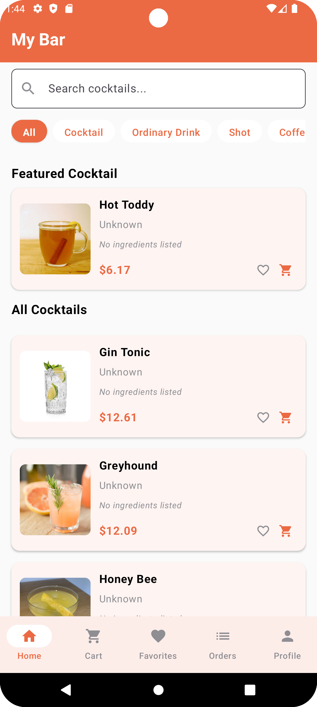

# CocktailCraft App

## Overview
CocktailCraft is a Kotlin Multiplatform project for a feature-rich cocktail ordering and discovery application, designed to run in Android platform. The app allows users to browse, search, and order various cocktails, manage their shopping cart, track orders, and maintain a profile. It leverages modern mobile app development practices including MVVM architecture, reactive programming, and dependency injection.



## Features
- **Cocktail Discovery**: Browse and search for cocktails with detailed information
- **Shopping Cart**: Add cocktails to cart, update quantities, and checkout
- **User Authentication**: Register, login, and manage user profiles
- **Order Management**: Place orders and track order history
- **Favorites**: Save and manage favorite cocktails
- **Reviews**: Read and submit reviews for cocktails
- **Dark Mode Support**: Adaptive UI that supports both light and dark themes with smooth transitions
- **Offline Mode**: Browse recently viewed cocktails and favorites without internet connection
- **Robust Error Handling**: User-friendly error messages with recovery options
- **Cross-Platform**: Same codebase for both Android and iOS platforms

## Architecture
The application follows the **Clean Architecture** pattern with **MVVM** (Model-View-ViewModel) for presentation:

```
┌─────────────────────────────────────────────────────────┐
│                       Presentation                       │
│  ┌─────────────┐       ┌─────────────┐ ┌─────────────┐  │
│  │   Screens   │◄─────►│  ViewModels │ │ UI Elements │  │
│  └─────────────┘       └─────────────┘ └─────────────┘  │
└───────────────────────────┬─────────────────────────────┘
                            │
┌───────────────────────────▼─────────────────────────────┐
│                        Domain                           │
│  ┌─────────────┐       ┌─────────────┐ ┌─────────────┐  │
│  │   Models    │       │  Use Cases  │ │Repositories │  │
│  └─────────────┘       └─────────────┘ └─────────────┘  │
└───────────────────────────┬─────────────────────────────┘
                            │
┌───────────────────────────▼─────────────────────────────┐
│                         Data                            │
│  ┌─────────────┐       ┌─────────────┐ ┌─────────────┐  │
│  │ Repository  │       │ Data Source │ │   Mappers   │  │
│  │   Impl      │◄─────►│  Remote/    │ │             │  │
│  │             │       │   Local     │ │             │  │
│  └─────────────┘       └─────────────┘ └─────────────┘  │
└─────────────────────────────────────────────────────────┘
```

### Key Architecture Components:
- **Shared Module**: Contains common business logic, models, and repositories that can be used across platforms
- **Platform-Specific Apps**: Android and iOS implementations with platform-specific UI and functionality
- **MVVM Pattern**: Separates UI (View) from business logic (ViewModel) and data management (Model)
- **Repository Pattern**: Abstracts data sources and provides a clean API for the domain layer
- **Dependency Injection**: Modular Koin setup for better testability and separation of concerns

For more detailed architecture diagrams, please see the [Architecture Documentation](docs/README.md) which includes high-level architecture, component diagrams, use case diagrams, and more.

### Dependency Injection
The app uses Koin for dependency injection with a modular approach:
- **Modular Structure**: Separate modules for network, data, and domain layers
- **Testability**: Easy mocking and test module setup
- **ViewModel Integration**: Standardized pattern for ViewModel dependency injection

For detailed information about the dependency injection implementation, see:
- [Dependency Injection Documentation](docs/DependencyInjection.md) - Overview, module structure, and best practices
- [Dependency Injection Migration Guide](docs/DependencyInjectionMigration.md) - Guide for migrating existing code to the new DI approach

## Libraries Used

### Core & Architecture
- **Kotlin Multiplatform**: For sharing code between Android and iOS
- **Coroutines + Flow**: For asynchronous programming and reactive streams
- **Koin**: For dependency injection
- **Ktor**: For networking and API calls
- **Kotlinx.Serialization**: For JSON parsing
- **Multiplatform Settings**: For cross-platform data storage

### UI & Navigation
- **Jetpack Compose**: Modern declarative UI toolkit for Android
- **Material3**: For consistent Material Design implementation
- **Accompanist**: Compose UI utilities
- **Navigation Compose**: For handling navigation between screens
- **Coil & Kamel**: For image loading and caching

### Testing
- **JUnit**: For unit testing
- **Mockito & Mockk**: For mocking in tests
- **Turbine**: For testing Flow emissions
- **Espresso**: For UI testing

### Detailed Libraries Table

| Library | Version | Purpose |
|---------|---------|---------|
| **Core & Architecture** |  |  |
| Kotlin | 2.0.21 | Programming language for cross-platform development |
| Kotlin Coroutines | 1.10.1 | Asynchronous programming framework |
| Koin | 4.0.1 | Modular dependency injection framework |
| Ktor | 3.0.3 | HTTP client for API communication |
| Kotlinx Serialization | 1.7.3 | JSON/data serialization |
| Multiplatform Settings | 1.1.1 | Cross-platform settings/preferences storage |
| Kotlinx DateTime | 0.6.0 | Date and time handling |
| **UI & Navigation** |  |  |
| Jetpack Compose | 1.2.0-alpha01-dev709 | Modern declarative UI toolkit |
| Compose Material3 | 1.3.1 | Material Design 3 implementation for Compose |
| Compose BOM | 2025.02.00 | Bill of Materials for Compose dependencies |
| Activity Compose | 1.8.0 | Integration between Compose and Activities |
| Navigation Compose | 2.8.8 | Navigation framework for Compose |
| Accompanist | 0.32.0 | Utilities for Jetpack Compose |
| Coil | 2.6.0 | Image loading library for Android |
| Kamel | 1.0.3 | Multiplatform image loading library |
| **State Management** |  |  |
| Lifecycle ViewModel | 2.8.7 | Component to store and manage UI-related data |
| DataStore | 1.1.3 | Data storage solution (replaces SharedPreferences) |
| **Security** |  |  |
| Security Crypto | 1.1.0-alpha06 | Encryption and security utilities |
| **Testing** |  |  |
| JUnit | 4.13.2 | Unit testing framework |
| Mockito | Various | Mocking framework for unit tests |
| Mockk | 1.13.8 | Kotlin-friendly mocking library |
| Turbine | 1.0.0 | Testing library for Kotlin Flow |
| Espresso | 3.6.1 | UI testing framework for Android |
| **Dependency Injection** |  |  |
| Koin | 4.0.1 | Modular dependency injection framework with improved testability |
| Koin Test | 4.0.1 | Testing utilities for Koin dependency injection |

## Package Structure

### Domain Layer
- **Models**: Data classes representing core business entities like `Cocktail`, `User`, `Order`, etc.
- **Repositories**: Interfaces defining data access contracts
- **UseCases**: Business logic operations and workflows

### Data Layer
- **Repository Implementations**: Concrete implementations of repository interfaces
- **Remote Data Sources**: API clients and network-related code
- **Local Data Sources**: Database and preference storage

### Presentation Layer (Android)
- **ViewModels**: Manage UI state and handle user interactions
- **Screens**: Compose UI components representing app screens
- **UI Elements**: Reusable UI components

## Key Features Implementation

### Cart Functionality
- **CartViewModel**: Manages cart state and operations like adding/removing items and checkout
- **CartRepository**: Handles cart data persistence and retrieval
- **CartScreen**: UI for displaying and managing cart items

### User Authentication
- **AuthRepository**: Handles user registration, login, and session management
- **ProfileViewModel**: Manages user profile data and settings
- **ProfileScreen**: UI for user authentication and profile management

### Cocktail Discovery
- **HomeViewModel**: Manages cocktail listings, categories, and search
- **CocktailRepository**: Provides cocktail data from remote and local sources
- **HomeScreen & CocktailDetailScreen**: UI for browsing and viewing cocktail details

### Dark Mode Support
- **ThemeViewModel**: Manages theme state and preferences
- **AppTheme**: Provides theme-specific colors and typography
- **ThemeAwareComponents**: UI components that adapt to the current theme
- **Smooth Transitions**: Animated transitions between light and dark modes
- **System Integration**: Option to follow system theme settings

### Offline Mode
- **NetworkMonitor**: Detects and monitors network connectivity
- **OfflineRepository**: Caches data for offline access
- **CocktailRepository**: Provides fallback to cached data when offline
- **UI Indicators**: Clear indicators of offline status and available actions

### Error Handling
- **ErrorUtils**: Centralized error handling and categorization
- **BaseViewModel**: Common error handling for all ViewModels
- **ErrorDialog & ErrorBanner**: User-friendly error display components
- **Recovery Actions**: Actionable error messages with recovery options

## Test Coverage
The application includes comprehensive test coverage:

- **Unit Tests**: Testing individual components in isolation
- **Integration Tests**: Testing component interactions
- **ViewModel Tests**: Verifying ViewModel behavior and state management
- **Repository Tests**: Testing data access and manipulation
- **UI Tests**: Verifying screen workflows and user interactions

## Setup & Running the Project
1. **Clone the Repository**:
   ```bash
   git clone <repository-url>
   cd CocktailCraft
   ```

2. **Open the Project**:
   - Open the project in Android Studio.

3. **Sync the Project**:
   - Allow Gradle to sync and download all necessary dependencies.

4. **Run on Android**:
   - Select the `androidApp` configuration
   - Choose an emulator or device
   - Click Run

## Development Setup
- **Android Studio**: Latest version recommended (Flamingo or newer)
- **JDK**: Version 17 or higher
- **Xcode**: Latest version (for iOS development)
- **Gradle**: Managed by the project
- **Git**: For version control

## Troubleshooting
- **Build Issues**: Try cleaning and rebuilding the project
- **KMP Plugin Issues**: Make sure the Kotlin Multiplatform plugin is up to date
- **iOS Builds**: Make sure the Kotlin/Native target is properly configured
- **Dependency Resolution**: Check Gradle settings and versions.toml file

## Contributing
Contributions are welcome! Please follow the standard GitHub flow:
1. Fork the repository
2. Create a feature branch
3. Make your changes
4. Submit a pull request


## Detailed Test Cases

### ViewModel Tests

#### CartViewModelTest
- **`initial state should load cart items and total`**: Validates that the CartViewModel properly initializes by loading cart items and calculating the total price.
- **`addToCart should add item to cart`**: Verifies that adding an item to the cart correctly calls the repository method and refreshes the cart data.
- **`removeFromCart should remove item from cart`**: Ensures that removing an item from the cart correctly calls the repository method and updates the cart state.
- **`updateQuantity should update item quantity in cart`**: Tests that updating an item's quantity properly calls the repository method with the correct parameters.
- **`clearCart should clear all items from cart`**: Confirms that the clearCart function properly calls the repository method and refreshes the cart.
- **`error handling should set error state`**: Validates that the ViewModel correctly handles and exposes errors that occur during cart operations.

#### ProfileViewModelTest
- **`initial state should be not signed in`**: Verifies that the initial state of the ProfileViewModel correctly reflects a user not being signed in.
- **`initial user should be null`**: Ensures that the user object is initially null when no user is signed in.
- **`sign in success should update state`**: Tests that a successful sign-in updates the signed-in state and user object.
- **`sign in failure should set error state`**: Validates error handling during the sign-in process.
- **`sign out should update state`**: Ensures that signing out properly updates the authentication state and clears user data.
- **`update profile should call repository and refresh user data`**: Tests that profile updates are properly handled and user data is refreshed.

#### OrderViewModelTest
- **`place order should create order from cart items`**: Verifies that placing an order correctly creates an order from the current cart items.
- **`get orders should load user orders`**: Tests that the ViewModel correctly loads and exposes user orders.
- **`cancel order should update order status`**: Validates that canceling an order updates its status appropriately.
- **`track order should return order details`**: Ensures that order tracking functionality returns the correct order information.

### Domain Layer Tests

#### PlaceOrderUseCaseTest
- **`invoke should create order and add to repository`**: Tests that the PlaceOrderUseCase correctly creates an order from cart items and adds it to the repository.
- **`invoke should handle empty cart`**: Verifies appropriate handling of empty cart situations.
- **`invoke should handle repository errors`**: Tests error handling when repository operations fail.
- **`generated order should have correct properties`**: Ensures that generated orders have the correct properties including ID format, items list, and pricing.

### Repository Tests

#### AuthRepositoryImplTest
- **`signUp should return success when email is not taken`**: Validates that user registration works when the email is available.
- **`signUp should return failure when email is already taken`**: Tests that registration fails appropriately when the email is already in use.
- **`signIn should return success with valid credentials`**: Ensures authentication works with correct credentials.
- **`signIn should return failure with invalid credentials`**: Verifies that authentication fails with incorrect credentials.
- **`signOut should clear current user`**: Tests that the sign-out process correctly clears user session data.
- **`isUserSignedIn should return true when user is signed in`**: Validates the signed-in state detection.
- **`getCurrentUser should return correct user data`**: Ensures that the repository correctly returns the current user's data.
- **`updateProfile should update user information`**: Tests that profile updates are correctly stored.

### Running Tests
To run the tests, you can use:

- **Android Studio**:
  - Right-click on a test class or method and select "Run"
  - Navigate to the test directory, right-click and select "Run Tests in..."

- **Command Line**:
  ```bash
  ./gradlew test        # Run all tests
  ./gradlew :androidApp:testDebugUnitTest  # Run Android unit tests
  ```

