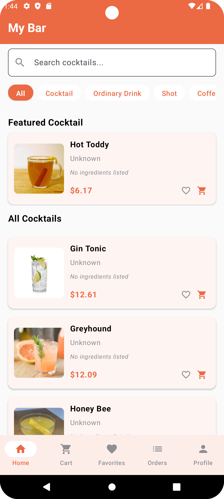

# CocktailCraft App

## Overview
CocktailCraft is a Kotlin Multiplatform project for a feature-rich cocktail ordering and discovery application, designed to run on both Android and iOS platforms. The app allows users to browse, search, and order various cocktails, manage their shopping cart, track orders, and maintain a profile. It leverages modern mobile app development practices including MVVM architecture, reactive programming, and dependency injection.

### Platform Status
- **Android**: ✅ Fully functional and production-ready
- **iOS**: ✅ **iOS 18.5 Ready** - Complete SKIE integration (100%) with native Swift async/await patterns



## Features
- **Cocktail Discovery**: Browse and search for cocktails with detailed information
- **Advanced Search & Filtering**: Multi-criteria search with filters for ingredients, taste profiles, complexity, and more
- **Shopping Cart**: Add cocktails to cart, update quantities, and checkout
- **User Authentication**: Register, login, and manage user profiles
- **Order Management**: Place orders and track order history
- **Favorites**: Save and manage favorite cocktails
- **Reviews**: Read and submit reviews for cocktails
- **Personalized Recommendations**: "You might also like" suggestions based on viewing history and preferences
- **Dark Mode Support**: Adaptive UI that supports both light and dark themes with smooth transitions
- **Offline Mode**: Browse recently viewed cocktails and favorites without internet connection
- **Background Sync**: Automatic data synchronization when app is backgrounded for fresh content on launch
- **Robust Error Handling**: User-friendly error messages with recovery options
- **Polished Animations**: Enhanced user experience with smooth animations and micro-interactions
- **Cross-Platform**: Same codebase for both Android and iOS platforms with platform-specific UI components
- **iOS 18.5 Ready**: Complete SKIE integration (100%) with native Swift async/await and modern SwiftUI reusable components

## Architecture
The application follows the **Clean Architecture** pattern with **MVVM** (Model-View-ViewModel) for presentation, reactive state management, and a modular **Dependency Injection** system:

```
┌─────────────────────────────────────────────────────────────────────────────────┐
│                              Presentation Layer                                  │
│                                                                                  │
│  ┌─────────────┐       ┌─────────────────┐       ┌───────────────────┐          │
│  │   Screens   │◄─────►│    ViewModels   │◄─────►│    UI Elements    │          │
│  │  (Compose)  │       │(SharedViewModel)│       │ (Compose/Material)│          │
│  └─────────────┘       └─────────────────┘       └───────────────────┘          │
│         ▲                       ▲                         ▲                      │
│         │                       │                         │                      │
│         ▼                       ▼                         ▼                      │
│  ┌─────────────┐       ┌─────────────────┐       ┌───────────────────┐          │
│  │  Navigation │       │  State Handling │       │   Theme Manager   │          │
│  │  (Compose)  │       │  (StateFlow)    │       │   (Dark Mode)     │          │
│  └─────────────┘       └─────────────────┘       └───────────────────┘          │
└─────────────────────────────────┬─────────────────────────────────────────────┘
                                  │
┌─────────────────────────────────▼─────────────────────────────────────────────┐
│                               Domain Layer                                     │
│                                                                                │
│  ┌─────────────┐       ┌─────────────────┐       ┌───────────────────┐        │
│  │   Models    │       │    Use Cases    │       │    Repositories   │        │
│  │             │       │                 │       │    (Interfaces)   │        │
│  └─────────────┘       └─────────────────┘       └───────────────────┘        │
└─────────────────────────────────┬─────────────────────────────────────────────┘
                                  │
┌─────────────────────────────────▼─────────────────────────────────────────────┐
│                               Data Layer                                       │
│                                                                                │
│  ┌─────────────┐       ┌─────────────────┐       ┌───────────────────┐        │
│  │ Repository  │       │   Data Sources  │       │      Mappers      │        │
│  │    Impl     │◄─────►│ Remote / Local  │       │                   │        │
│  └─────────────┘       └─────────────────┘       └───────────────────┘        │
│         ▲                       ▲                                              │
│         │                       │                                              │
│         ▼                       ▼                                              │
│  ┌─────────────┐       ┌─────────────────┐                                    │
│  │   Offline   │       │  Error Handling │                                    │
│  │   Support   │       │  (ErrorUtils)   │                                    │
│  └─────────────┘       └─────────────────┘                                    │
└─────────────────────────────────┬─────────────────────────────────────────────┘
                                  │
┌─────────────────────────────────▼─────────────────────────────────────────────┐
│                         Dependency Injection                                   │
│                                                                                │
│  ┌─────────────┐       ┌─────────────────┐       ┌───────────────────┐        │
│  │  Network    │       │      Data       │       │      Domain       │        │
│  │   Module    │       │     Module      │       │      Module       │        │
│  └─────────────┘       └─────────────────┘       └───────────────────┘        │
│                                                                                │
│  ┌─────────────────────────────────────────────────────────────────────┐      │
│  │                          Platform Module                             │      │
│  └─────────────────────────────────────────────────────────────────────┘      │
└────────────────────────────────────────────────────────────────────────────────┘
```

### Key Architecture Components:
- **Shared Module**: Contains common business logic, models, and repositories that can be used across platforms
- **Platform-Specific Apps**: Android and iOS implementations with platform-specific UI and functionality
- **MVVM Pattern**: Separates UI (View) from business logic (ViewModel) and data management (Model)
- **Repository Pattern**: Abstracts data sources and provides a clean API for the domain layer
- **Use Case Pattern**: Encapsulates business logic in single-responsibility classes
- **Dependency Injection**: Modular Koin setup for better testability and separation of concerns

### Architecture Layers:
- **Presentation Layer**:
  - **Screens**: Platform-specific UI components that display data and handle user interactions
    - **Android**: Jetpack Compose UI components (see [Android UI Components Documentation](docs/UI_Components.md))
    - **iOS**: SwiftUI views and components (see [iOS UI Components Documentation](docs/iOS_UI_Components.md))
  - **ViewModels**: Manage UI state, process user actions, and communicate with the domain layer
  - **UI Elements**: Reusable components for consistent UI across platforms
  - **SharedViewModel**: Multiplatform base class (on androidx `ViewModel`) with the shared error channel; ViewModels are constructor-injected and registered in Koin
  - **Navigation**: Compose Navigation for handling screen transitions and deep linking
  - **State Handling**: Kotlin StateFlow and SharedFlow for reactive UI updates
  - **Theme Manager**: Manages light/dark mode and theme preferences with smooth transitions

- **Domain Layer**:
  - **Models**: Core business entities that represent the application's data structures
  - **Use Cases**: Business logic operations that orchestrate data flow between UI and data layers
  - **Repository Interfaces**: Define contracts for data access without implementation details
  - **Business Rules**: Encapsulate application-specific business logic and validation

- **Data Layer**:
  - **Repository Implementations**: Concrete implementations of repository interfaces
  - **Data Sources**: Remote (API) and local (cache/database) data access
  - **Mappers**: Convert between data models and domain models
  - **Network Utilities**: Handle API communication, caching, and offline support
  - **Offline Support**: CocktailCache and NetworkMonitor for offline functionality
  - **Error Handling**: Centralized error handling with ErrorUtils and recovery options

- **Dependency Injection Layer**:
  - **Network Module**: Provides HTTP client, API interfaces, and network monitoring
  - **Data Module**: Provides repositories and caching mechanisms
  - **Domain Module**: Provides use cases, shared ViewModels, and application configuration
  - **Platform Module**: Provides platform-specific dependencies

### Cross-Cutting Concerns:
- **Error Handling**: Standardized error handling through SharedViewModel with user-friendly messages
- **Offline Mode**: Network state monitoring and data caching for offline access
- **Reactive Programming**: Kotlin Flow for asynchronous data streams and UI updates
- **Dependency Injection**: Modular Koin setup for better testability and separation of concerns
- **Dark Mode**: System-integrated and user-configurable theme preferences

For more detailed architecture diagrams, please see the [Architecture Documentation](docs/README.md) which includes high-level architecture, component diagrams, use case diagrams, and more.

### Animations and Transitions
The app features a comprehensive set of animations and transitions to enhance the user experience:
- **Micro-interactions**: Button animations, hover effects, and feedback animations
- **List Animations**: Staggered entry animations and smooth item transitions
- **Loading States**: Shimmer loading effects for a polished loading experience
- **Screen Transitions**: Coordinated animations for navigation between screens
- **Theme Transitions**: Smooth animations when switching between light and dark modes
- **Optimized Scrolling**: Batched loading mechanism that loads and animates items in small groups
- **Performance Optimizations**: Techniques to maintain smooth animations during fast scrolling

The animation system is designed for both visual appeal and performance:
- **Batched Loading**: Items load in groups of 3 with staggered animations for better performance
- **Predictive Loading**: Preloads items that will soon be visible (3 batches ahead of current view)
- **Direct Animation Properties**: Uses optimized animation properties for smooth scrolling
- **Coordinated Animations**: Items within the same batch animate together for a cohesive effect

For detailed information about the animations implementation, see:
- [Animations Documentation](docs/animations.md) - Overview, implementation details, and best practices

### Dependency Injection
The app uses Koin for dependency injection with a modular approach:
- **Modular Structure**: Separate modules for network, data, and domain layers
- **Testability**: Easy mocking and test module setup
- **ViewModel Integration**: Standardized pattern for ViewModel dependency injection

For detailed information about the dependency injection implementation, see:
- [Dependency Injection Documentation](docs/DependencyInjection.md) - Overview, module structure, and best practices

## Libraries Used

### Core & Architecture
- **Kotlin Multiplatform**: For sharing code between Android and iOS
- **Coroutines + Flow**: For asynchronous programming and reactive streams
- **Koin**: For dependency injection
- **Ktor**: For networking and API calls
- **Kotlinx.Serialization**: For JSON parsing
- **Multiplatform Settings**: For cross-platform data storage

### UI & Navigation
- **Jetpack Compose**: Modern declarative UI toolkit for Android
- **Material3**: For consistent Material Design implementation
- **Accompanist**: Compose UI utilities
- **Navigation Compose**: For handling navigation between screens
- **Coil & Kamel**: For image loading and caching
- **Animation Utilities**: Custom animation components and utilities for enhanced UX
- **Shimmer Effects**: Loading state animations with shimmer effects

### Testing
- **JUnit Jupiter**: Modern unit testing framework (5.10.1)
- **kotlin-test**: Multiplatform testing support (2.0.21)
- **Jetpack Compose UI Testing**: UI testing for Compose (2025.02.00)
- **Mockk**: Kotlin-friendly mocking library (1.13.8)
- **Turbine**: For testing Flow emissions (1.0.0)
- **XCUITest**: iOS UI testing framework
- **Koin Test**: Dependency injection testing utilities
- **Robolectric**: Android unit testing framework

**Testing Setup:**
- [Testing Implementation Summary](docs/TESTING_IMPLEMENTATION_SUMMARY.md) - Complete testing framework overview and setup

See the [Testing](#testing) section below for where the test suites live and how to run them.

For a detailed list of all libraries with versions and purposes, see the [Libraries Documentation](docs/Libraries.md).

For information about the reusable UI components in the app, see:
- [Android UI Components Documentation](docs/UI_Components.md) - Jetpack Compose components and design system
- [iOS UI Components Documentation](docs/iOS_UI_Components.md) - SwiftUI components and design system

For details about the iOS migration, SKIE implementation, and native Swift async/await integration, see the [SKIE Full Migration Guide](docs/SKIE_FULL_MIGRATION_GUIDE.md).

## Package Structure

### Domain Layer
- **Models**: Data classes representing core business entities like `Cocktail`, `User`, `Order`, etc.
- **Repositories**: Interfaces defining data access contracts
- **UseCases**: Business logic operations and workflows

### Data Layer
- **Repository Implementations**: Concrete implementations of repository interfaces
- **Remote Data Sources**: API clients and network-related code
- **Local Data Sources**: Database and preference storage

### Presentation Layer (Android)
- **ViewModels**: Manage UI state and handle user interactions
- **Screens**: Compose UI components representing app screens
- **UI Elements**: Reusable UI components

## Key Features Implementation

### Cart Functionality
- **SharedCartViewModel**: Manages cart state and operations like adding/removing items and checkout
- **CartRepository**: Handles cart data persistence and retrieval
- **CartScreen**: UI for displaying and managing cart items

### User Authentication
- **AuthRepository**: Handles user registration, login, and session management
- **SharedProfileViewModel**: Manages user profile data and settings
- **ProfileScreen**: UI for user authentication and profile management

### Cocktail Discovery
- **SharedHomeViewModel**: Manages cocktail listings, categories, and search
- **CocktailSearchRepository / CocktailCatalogRepository / CocktailDetailRepository**: Focused repositories providing cocktail data from remote and cached sources
- **HomeScreen & CocktailDetailScreen**: UI for browsing and viewing cocktail details

### Recommendation System
- **GetCocktailDetailUseCase.getRelatedCocktails**: Client-side, category-based related-cocktail suggestions
- **Detail screen sections**: "You might also like" carousels on both platforms, fed by `relatedCocktails` in the shared detail state
- **Offline Support**: Works with cached data when no internet connection is available

### Dark Mode Support
- **SharedThemeViewModel**: Manages theme state and preferences
- **AppTheme**: Provides theme-specific colors and typography
- **ThemeAwareComponents**: UI components that adapt to the current theme
- **Smooth Transitions**: Animated transitions between light and dark modes
- **System Integration**: Option to follow system theme settings

### Offline Mode
- **NetworkMonitor**: Detects and monitors network connectivity
- **CocktailOfflineRepository**: Owns offline mode, connectivity checks, recently viewed, and cache clearing
- **OfflineModePolicy + CocktailCache**: Single source of truth for "is the app offline" and the cached-data fallback used by the other cocktail repositories
- **UI Indicators**: Clear indicators of offline status and available actions

### Error Handling
- **ErrorUtils**: Centralized error handling and categorization
- **SharedViewModel**: Common error handling for all ViewModels
- **ErrorDialog & ErrorBanner**: User-friendly error display components
- **Recovery Actions**: Actionable error messages with recovery options

## Test Coverage
The application includes comprehensive test coverage:

- **Unit Tests**: Testing individual components in isolation
- **Integration Tests**: Testing component interactions
- **ViewModel Tests**: Verifying ViewModel behavior and state management
- **Repository Tests**: Testing data access and manipulation
- **UI Tests**: Verifying screen workflows and user interactions

## Setup & Running the Project
1. **Clone the Repository**:
   ```bash
   git clone <repository-url>
   cd CocktailCraft
   ```

2. **Open the Project**:
   - Open the project in Android Studio.

3. **Sync the Project**:
   - Allow Gradle to sync and download all necessary dependencies.

4. **Run on Android**:
   - Select the `androidApp` configuration
   - Choose an emulator or device
   - Click Run

5. **Run on iOS** (macOS only):
   - Build the shared framework: `./gradlew :shared:podPublishXCFramework`
   - Navigate to `iosApp` directory: `cd iosApp`
   - Generate the Xcode project from the spec: `xcodegen generate` (`brew install xcodegen`)
   - Install CocoaPods dependencies: `pod install`
   - Open `CocktailCraft.xcworkspace` in Xcode
   - Select a simulator and run the app
   - See [iOS Setup Instructions](iosApp/iOS_Setup_Instructions.md) for detailed setup

## Development Setup
- **Android Studio**: Latest version recommended (Flamingo or newer)
- **JDK**: Version 17 or higher
- **Xcode**: Latest version (for iOS development)
- **Gradle**: Managed by the project
- **Git**: For version control

## Troubleshooting
- **Build Issues**: Try cleaning and rebuilding the project
- **KMP Plugin Issues**: Make sure the Kotlin Multiplatform plugin is up to date
- **iOS Builds**: ✅ **Working with SKIE integration!** See [iOS Setup Instructions](iosApp/iOS_Setup_Instructions.md) and the [SKIE Full Migration Guide](docs/SKIE_FULL_MIGRATION_GUIDE.md) for details
- **iOS Build Warnings**: Non-blocking warnings exist (see iOS documentation for details)
- **Dependency Resolution**: Check Gradle settings and versions.toml file

## Documentation

### 📚 **Core Documentation**
- [iOS Background Sync Implementation](docs/ios-background-sync.md) - Comprehensive guide to the background sync feature
- [Background Sync Quick Reference](docs/background-sync-quick-reference.md) - Developer quick start guide
- [iOS Setup Instructions](iosApp/iOS_Setup_Instructions.md) - Complete iOS development setup
- [SKIE Full Migration Guide](docs/SKIE_FULL_MIGRATION_GUIDE.md) - iOS compatibility and SKIE integration details

### 🐛 **QA & Debugging Tools**
- [DebugSwift Complete Installation Guide](docs/DebugSwift_Complete_Installation_Guide.md) - Full integration process with all issues and solutions
- [DebugSwift Quick Reference](docs/DebugSwift_Quick_Reference.md) - Daily usage guide for QA testing
- [DebugSwift Integration Details](iosApp/DebugSwift_Integration.md) - Technical implementation details

### 🔧 **Technical Guides**
- **Background Sync**: Automatic data synchronization for iOS with BGTaskScheduler integration
- **SKIE Integration**: 100% native Swift async/await patterns for seamless iOS development
- **Architecture**: Clean Architecture with MVVM pattern and dependency injection
- **Cross-Platform**: Shared business logic with platform-specific UI implementations

## Contributing
Contributions are welcome! Please follow the standard GitHub flow:
1. Fork the repository
2. Create a feature branch
3. Make your changes
4. Submit a pull request


## Testing

The test suites live alongside the code they cover — the tests themselves are the up-to-date catalog:

- **Shared (KMP)**: `shared/src/commonTest` — ViewModels, use cases, repositories, cache, DI graph
- **Android**: `androidApp/src/test` (unit) and `androidApp/src/androidTest` (instrumented/UI)
- **iOS**: `iosApp/CocktailCraftTests` (unit) and `iosApp/CocktailCraftUITests` (XCUITest)

Run them with:

```bash
./gradlew :shared:testAndroidHostTest       # Shared module tests
./gradlew :androidApp:testDebugUnitTest     # Android unit tests
# iOS (from iosApp/, after pod install / xcodegen generate):
xcodebuild test -workspace CocktailCraft.xcworkspace -scheme CocktailCraft \
  -destination 'platform=iOS Simulator,name=iPhone 16'
```

