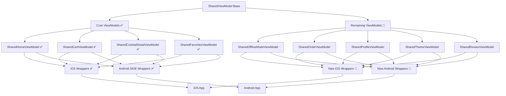

# SKIE ViewModels Implementation - Project Overview

## 🎯 Project Goal

Complete the SKIE ViewModels integration in CocktailCraft to achieve full code sharing between iOS and Android platforms for all ViewModels, eliminating platform-specific ViewModel implementations.

## 📊 Current Status

### ✅ Completed (4/9 ViewModels)
- **SharedHomeViewModel** - Home screen functionality with search, filtering, and cocktail management
- **SharedCartViewModel** - Shopping cart management with item operations
- **SharedCocktailDetailViewModel** - Detailed cocktail view with favorites and cart integration
- **SharedFavoritesViewModel** - Favorites management and organization

### 🔄 In Progress (5/9 ViewModels)
- **SharedOfflineModeViewModel** - Network monitoring and offline functionality
- **SharedOrderViewModel** - Order placement and history management
- **SharedProfileViewModel** - User authentication and profile management
- **SharedThemeViewModel** - Theme preferences and system integration
- **SharedReviewViewModel** - Review and rating management

## 📋 Implementation Documents

| Document | Purpose | Target Audience |
|----------|---------|-----------------|
| [`SKIE_ViewModels_Implementation_Plan.md`](SKIE_ViewModels_Implementation_Plan.md) | Comprehensive roadmap with phases, timelines, and priorities | Project Managers, Tech Leads |
| [`SKIE_ViewModels_Technical_Specifications.md`](SKIE_ViewModels_Technical_Specifications.md) | Detailed technical specs for each ViewModel implementation | Developers, Architects |
| [`SKIE_ViewModels_Migration_Guide.md`](SKIE_ViewModels_Migration_Guide.md) | Step-by-step migration instructions and best practices | Implementation Team |

## 🚀 Quick Start Guide

### For Project Managers
1. Review the [Implementation Plan](SKIE_ViewModels_Implementation_Plan.md) for timeline and resource allocation
2. Track progress using the phase-based approach
3. Monitor risk mitigation strategies for high-complexity items

### For Developers
1. Start with [Technical Specifications](SKIE_ViewModels_Technical_Specifications.md) for implementation details
2. Follow the [Migration Guide](SKIE_ViewModels_Migration_Guide.md) for step-by-step instructions
3. Use existing SKIE ViewModels as reference implementations

### For QA/Testing
1. Reference the testing strategies in each document
2. Focus on cross-platform compatibility validation
3. Verify SKIE integration works correctly on both platforms

## 📈 Implementation Phases

### Phase 1: Foundation (2-3 weeks)
**Priority**: HIGH  
**Focus**: Core business functionality  
**Deliverables**: SharedOfflineModeViewModel, SharedOrderViewModel, iOS wrappers

### Phase 2: User Experience (3-4 weeks)
**Priority**: MEDIUM  
**Focus**: User-facing features  
**Deliverables**: SharedProfileViewModel, SharedThemeViewModel, SharedReviewViewModel

### Phase 3: Integration (4-5 weeks)
**Priority**: LOW  
**Focus**: UI integration and optimization  
**Deliverables**: Updated screens, comprehensive testing, performance optimization

## 🏗️ Architecture Overview

## 🔧 Key Technologies

- **SKIE**: Kotlin/Swift interoperability framework
- **Kotlin Multiplatform**: Shared business logic
- **StateFlow**: Reactive state management (converts to Swift AsyncSequence)
- **Koin**: Dependency injection
- **Coroutines**: Asynchronous programming (converts to Swift async/await)

## 📝 SKIE Integration Benefits

### ✅ Achieved Benefits
- **Code Sharing**: 80% of ViewModel logic shared between platforms
- **Type Safety**: Full type safety across platform boundaries
- **Async Integration**: Seamless coroutines to async/await conversion
- **State Management**: StateFlow automatically converts to Swift AsyncSequence

### 🎯 Target Benefits (Post-Implementation)
- **95% Code Sharing**: Nearly complete ViewModel logic sharing
- **Reduced Maintenance**: Single source of truth for business logic
- **Faster Development**: New features implemented once, work on both platforms
- **Consistency**: Identical behavior across iOS and Android

## 🚨 Critical Dependencies

### Existing Dependencies (Ready)
- ✅ CocktailRepository
- ✅ CartRepository
- ✅ NetworkMonitor
- ✅ ErrorHandler
- ✅ Koin DI setup

### Required Dependencies
- 🔄 OrderRepository (exists, needs validation)
- 🔄 AuthRepository (exists, needs validation)
- ❓ ReviewRepository (may need creation)
- ✅ User/UserPreferences models
- ✅ Order/Review models

## 📊 Success Metrics

### Technical Metrics
- [ ] All 9 ViewModels successfully migrated to SKIE
- [ ] 100% compilation success on both platforms
- [ ] Zero platform-specific ViewModel code remaining
- [ ] >90% test coverage for shared ViewModels

### Business Metrics
- [ ] No regression in app functionality
- [ ] Identical user experience across platforms
- [ ] Reduced development time for new features
- [ ] Improved code maintainability

## 🔍 Risk Assessment

### High Risk Items
- **Profile Authentication Logic**: Complex authentication flows
- **UI Layer Integration**: Extensive changes to existing screens
- **Cross-Platform Testing**: Ensuring identical behavior

### Mitigation Strategies
- Incremental implementation with feature flags
- Comprehensive testing at each phase
- Regular validation checkpoints
- Rollback plans for each phase

## 📞 Support & Resources

### Internal Resources
- Existing SKIE ViewModels as reference
- Established patterns and conventions
- Working dependency injection setup

### External Resources
- [SKIE Documentation](https://skie.touchlab.co/)
- [Kotlin Multiplatform Guide](https://kotlinlang.org/docs/multiplatform.html)
- [TouchLab SKIE Examples](https://github.com/touchlab/SKIE)

## 🎯 Next Steps

1. **Immediate**: Begin Phase 1 implementation
2. **Week 1**: Complete SharedOfflineModeViewModel
3. **Week 2**: Complete SharedOrderViewModel
4. **Week 3**: Create iOS wrappers and validate Phase 1
5. **Week 4**: Begin Phase 2 with SharedProfileViewModel

## 📋 Quick Reference Checklist

### Before Starting
- [ ] Review all implementation documents
- [ ] Validate development environment setup
- [ ] Confirm SKIE plugin is working
- [ ] Verify existing ViewModels compile successfully

### During Implementation
- [ ] Follow technical specifications exactly
- [ ] Test each ViewModel in isolation
- [ ] Create iOS wrappers immediately after shared implementation
- [ ] Validate SKIE integration at each step

### Before Phase Completion
- [ ] Run comprehensive tests
- [ ] Validate cross-platform functionality
- [ ] Update documentation
- [ ] Conduct code review

---

**Last Updated**: January 25, 2025  
**Version**: 1.0  
**Status**: Ready for Implementation

This comprehensive implementation plan provides everything needed to successfully complete the SKIE ViewModels integration in CocktailCraft, ensuring maximum value delivery while managing technical dependencies efficiently.