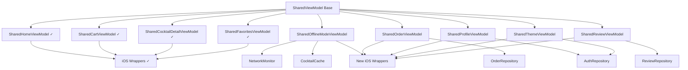

# CocktailCraft SKIE ViewModels Integration - Comprehensive Implementation Plan

## Executive Summary

This document outlines a systematic approach to complete the SKIE ViewModels integration in the CocktailCraft project. The plan is structured in three phases, prioritizing foundation work, user experience features, and optimization/cleanup.

**Current Status**: Core SKIE ViewModels (Home, Cart, CocktailDetail, Favorites) are successfully migrated and building.

**Remaining Work**: Complete integration of Order, Profile, Theme, Review, and OfflineMode ViewModels.

---

## Phase 1: High Priority - Foundation & Core Dependencies

### Overview
Focus on completing the core business functionality ViewModels that have existing dependencies and can be implemented immediately.

### Tasks

#### 1.1 Audit and Validate Existing SKIE ViewModels
- **Deliverable**: Validation report of current SKIE ViewModels
- **Complexity**: Low (2-4 hours)
- **Dependencies**: None
- **Success Criteria**: 
  - All existing ViewModels compile without errors
  - StateFlows properly exposed for SKIE
  - Suspend functions correctly marked for async conversion
- **Risk Assessment**: Low - existing code validation

#### 1.2 Create SharedOfflineModeViewModel
- **Deliverable**: [`SharedOfflineModeViewModel.kt`](shared/src/commonMain/kotlin/com/cocktailcraft/viewmodel/SharedOfflineModeViewModel.kt)
- **Complexity**: Medium (6-8 hours)
- **Dependencies**: NetworkMonitor, CocktailRepository, CocktailCache
- **Success Criteria**:
  - SKIE-compatible StateFlows for offline mode status
  - Network connectivity monitoring
  - Recently viewed cocktails management
  - Cache management functions
- **Risk Assessment**: Medium - depends on existing cache implementation

#### 1.3 Create SharedOrderViewModel
- **Deliverable**: [`SharedOrderViewModel.kt`](shared/src/commonMain/kotlin/com/cocktailcraft/viewmodel/SharedOrderViewModel.kt)
- **Complexity**: Medium (6-8 hours)
- **Dependencies**: OrderRepository, PlaceOrderUseCase
- **Success Criteria**:
  - Order history management
  - Order placement functionality
  - Order status tracking
  - SKIE-compatible async functions
- **Risk Assessment**: Medium - depends on OrderRepository implementation

#### 1.4 Update DomainModule Registration
- **Deliverable**: Updated [`DomainModule.kt`](shared/src/commonMain/kotlin/com/cocktailcraft/di/DomainModule.kt)
- **Complexity**: Low (1-2 hours)
- **Dependencies**: Completed ViewModels from 1.2 and 1.3
- **Success Criteria**: All new ViewModels properly registered in Koin
- **Risk Assessment**: Low - straightforward dependency injection

#### 1.5 Create iOS Wrapper Classes
- **Deliverable**: iOS wrapper classes for new ViewModels
- **Complexity**: Medium (4-6 hours)
- **Dependencies**: Completed shared ViewModels
- **Success Criteria**:
  - Swift-compatible wrapper classes
  - Proper StateFlow to AsyncSequence conversion
  - ObservableObject conformance
- **Risk Assessment**: Low - following established patterns

---

## Phase 2: Medium Priority - User Experience Features

### Overview
Implement user-facing features that enhance the application experience but are not critical for core functionality.

### Tasks

#### 2.1 Create SharedProfileViewModel
- **Deliverable**: [`SharedProfileViewModel.kt`](shared/src/commonMain/kotlin/com/cocktailcraft/viewmodel/SharedProfileViewModel.kt)
- **Complexity**: High (8-10 hours)
- **Dependencies**: AuthRepository, User model
- **Success Criteria**:
  - User authentication management
  - Profile data management
  - Sign in/out functionality
  - SKIE-compatible async functions
- **Risk Assessment**: High - complex authentication logic

#### 2.2 Create SharedThemeViewModel
- **Deliverable**: [`SharedThemeViewModel.kt`](shared/src/commonMain/kotlin/com/cocktailcraft/viewmodel/SharedThemeViewModel.kt)
- **Complexity**: Medium (4-6 hours)
- **Dependencies**: AuthRepository, UserPreferences model
- **Success Criteria**:
  - Theme preference management
  - System theme following
  - Dark/light mode toggle
  - Preference persistence
- **Risk Assessment**: Medium - requires preference storage

#### 2.3 Create SharedReviewViewModel
- **Deliverable**: [`SharedReviewViewModel.kt`](shared/src/commonMain/kotlin/com/cocktailcraft/viewmodel/SharedReviewViewModel.kt)
- **Complexity**: Medium (6-8 hours)
- **Dependencies**: Review model, potential ReviewRepository
- **Success Criteria**:
  - Review management for cocktails
  - Rating calculations
  - Review submission
  - SKIE-compatible data structures
- **Risk Assessment**: Medium - may need new repository implementation

#### 2.4 Update Android SKIE Wrapper Classes
- **Deliverable**: Updated Android SKIE wrapper classes
- **Complexity**: Medium (4-6 hours)
- **Dependencies**: Completed shared ViewModels
- **Success Criteria**: Android wrappers for all new ViewModels
- **Risk Assessment**: Low - following established patterns

#### 2.5 Implement iOS ViewModelWrapper Classes
- **Deliverable**: iOS wrapper implementations
- **Complexity**: Medium (6-8 hours)
- **Dependencies**: Completed shared ViewModels
- **Success Criteria**: Complete iOS integration for all ViewModels
- **Risk Assessment**: Medium - iOS-specific implementation details

---

## Phase 3: Low Priority - Integration & Optimization

### Overview
Complete the integration by updating UI layers and optimizing the overall implementation.

### Tasks

#### 3.1 Update Android Screens
- **Deliverable**: Updated Android screen implementations
- **Complexity**: High (10-12 hours)
- **Dependencies**: All shared ViewModels completed
- **Success Criteria**: All screens use SKIE ViewModels instead of legacy ones
- **Risk Assessment**: High - extensive UI changes required

#### 3.2 Update iOS Views
- **Deliverable**: Updated iOS view implementations
- **Complexity**: High (10-12 hours)
- **Dependencies**: All shared ViewModels and wrappers completed
- **Success Criteria**: Complete iOS migration to shared ViewModels
- **Risk Assessment**: High - extensive UI changes required

#### 3.3 Create Comprehensive Unit Tests
- **Deliverable**: Test suite for all shared ViewModels
- **Complexity**: High (12-15 hours)
- **Dependencies**: All ViewModels completed
- **Success Criteria**: >90% code coverage for shared ViewModels
- **Risk Assessment**: Medium - testing infrastructure setup

#### 3.4 Performance Optimization Review
- **Deliverable**: Performance analysis and optimization report
- **Complexity**: Medium (6-8 hours)
- **Dependencies**: Complete implementation
- **Success Criteria**: Identified and resolved performance bottlenecks
- **Risk Assessment**: Medium - requires profiling tools

#### 3.5 Documentation and Migration Guide
- **Deliverable**: Complete documentation package
- **Complexity**: Medium (8-10 hours)
- **Dependencies**: Complete implementation
- **Success Criteria**: Comprehensive developer documentation
- **Risk Assessment**: Low - documentation task

---

## Validation & Cleanup Phase

### Tasks

#### 4.1 End-to-End Testing
- **Deliverable**: E2E test results and bug fixes
- **Complexity**: High (8-12 hours)
- **Dependencies**: Complete implementation
- **Success Criteria**: All critical user flows working on both platforms
- **Risk Assessment**: High - integration testing complexity

#### 4.2 Remove Deprecated Legacy ViewModels
- **Deliverable**: Cleaned codebase
- **Complexity**: Medium (4-6 hours)
- **Dependencies**: Successful E2E testing
- **Success Criteria**: No legacy ViewModels remaining
- **Risk Assessment**: Medium - ensure no breaking changes

#### 4.3 Final Code Review and Optimization
- **Deliverable**: Production-ready codebase
- **Complexity**: Medium (6-8 hours)
- **Dependencies**: Complete cleanup
- **Success Criteria**: Code review approval and final optimizations
- **Risk Assessment**: Low - final polish

---

## Implementation Architecture

### SKIE Integration Patterns

All shared ViewModels follow these patterns for optimal SKIE compatibility:

```kotlin
class SharedXxxViewModel : SharedViewModel() {
    // StateFlows - automatically converted to Swift AsyncSequence
    private val _state = MutableStateFlow(initialValue)
    val state: StateFlow<Type> = _state.asStateFlow()
    
    // Suspend functions - converted to Swift async functions
    suspend fun performAction() {
        // Implementation
    }
    
    // Synchronous helper methods - directly callable from Swift
    fun getComputedValue(): Type {
        return computation()
    }
}
```

### Dependency Flow



### Risk Mitigation Strategies

1. **High-Risk Items**:
   - Profile authentication logic: Implement comprehensive error handling
   - UI layer updates: Implement incrementally with feature flags
   - E2E testing: Set up automated testing pipeline

2. **Medium-Risk Items**:
   - Repository dependencies: Validate interfaces before implementation
   - iOS wrapper complexity: Follow established patterns strictly

3. **Low-Risk Items**:
   - Documentation: Use templates and automated generation where possible
   - Koin registration: Test in isolation before integration

### Success Metrics

- **Technical**: All ViewModels compile and build successfully
- **Functional**: All features work identically on iOS and Android
- **Performance**: No regression in app startup time or memory usage
- **Code Quality**: Maintain >90% test coverage for shared code
- **Developer Experience**: Clear migration path and documentation

### Timeline Estimation

- **Phase 1**: 2-3 weeks (20-30 hours)
- **Phase 2**: 3-4 weeks (30-40 hours)
- **Phase 3**: 4-5 weeks (40-50 hours)
- **Validation**: 1-2 weeks (15-25 hours)

**Total Estimated Effort**: 10-14 weeks (105-145 hours)

---

## Next Steps

1. Begin with Phase 1 tasks in order
2. Validate each ViewModel implementation before proceeding
3. Maintain continuous integration throughout the process
4. Regular progress reviews at the end of each phase

This plan provides a systematic approach to completing the SKIE ViewModels integration while managing technical dependencies and minimizing risks.