# Class Diagram

```mermaid
classDiagram
    %% Domain Models
    class Cocktail {
        +String id
        +String name
        +String? alternateName
        +List~String~? tags
        +String? category
        +String? iba
        +String? alcoholic
        +String? glass
        +String? instructions
        +String? imageUrl
        +List~CocktailIngredient~ ingredients
        +String? imageSource
        +String? imageAttribution
        +Boolean? creativeCommonsConfirmed
        +String? dateModified
        +Double price
        +Boolean inStock
        +Int stockCount
        +Float rating
        +Int popularity
        +Long dateAdded
    }
    
    class CocktailIngredient {
        +String name
        +String? measure
    }
    
    class CocktailCartItem {
        +Cocktail cocktail
        +Int quantity
    }
    
    class Order {
        +String id
        +String date
        +List~OrderItem~ items
        +Double total
        +String status
    }
    
    class OrderItem {
        +String name
        +Int quantity
        +Double price
    }
    
    class User {
        +String id
        +String name
        +String email
        +String? profileImageUrl
        +Boolean isLoggedIn
    }
    
    class Review {
        +String id
        +String cocktailId
        +String userId
        +String userName
        +Float rating
        +String comment
        +Long date
    }
    
    class SortOption {
        <<enumeration>>
        NEWEST
        PRICE_LOW_TO_HIGH
        PRICE_HIGH_TO_LOW
        POPULARITY
    }
    
    %% Repository Interfaces
    class CocktailRepository {
        <<interface>>
        +searchCocktailsByName(String name): Flow~List~Cocktail~~
        +searchCocktailsByFirstLetter(Char letter): Flow~List~Cocktail~~
        +getCocktailById(String id): Flow~Cocktail?~
        +getRandomCocktail(): Flow~Cocktail?~
        +filterByIngredient(String ingredient): Flow~List~Cocktail~~
        +filterByAlcoholic(Boolean alcoholic): Flow~List~Cocktail~~
        +filterByCategory(String category): Flow~List~Cocktail~~
        +filterByGlass(String glass): Flow~List~Cocktail~~
        +getCategories(): Flow~List~String~~
        +getGlasses(): Flow~List~String~~
        +getIngredients(): Flow~List~String~~
        +getAlcoholicFilters(): Flow~List~String~~
        +getFavoriteCocktails(): Flow~List~Cocktail~~
        +addToFavorites(Cocktail cocktail)
        +removeFromFavorites(Cocktail cocktail)
        +isCocktailFavorite(String id): Flow~Boolean~
        +getCocktailsSortedByNewest(): Flow~List~Cocktail~~
        +getCocktailsSortedByPriceLowToHigh(): Flow~List~Cocktail~~
        +getCocktailsSortedByPriceHighToLow(): Flow~List~Cocktail~~
        +getCocktailsSortedByPopularity(): Flow~List~Cocktail~~
        +getCocktailsByPriceRange(Double minPrice, Double maxPrice): Flow~List~Cocktail~~
        +getCocktailImageUrl(Cocktail cocktail): String
        +checkApiConnectivity(): Flow~Boolean~
    }
    
    class CartRepository {
        <<interface>>
        +getCartItems(): Flow~List~CocktailCartItem~~
        +addToCart(CocktailCartItem item)
        +removeFromCart(String cocktailId)
        +updateQuantity(String cocktailId, Int quantity)
        +clearCart()
        +getCartTotal(): Flow~Double~
    }
    
    class OrderRepository {
        <<interface>>
        +getOrders(): Flow~List~Order~~
        +getOrderById(String id): Flow~Order?~
        +addOrder(Order order)
        +updateOrderStatus(String orderId, String status)
    }
    
    class AuthRepository {
        <<interface>>
        +getCurrentUser(): Flow~User?~
        +login(String email, String password): Flow~Result~User~~
        +register(String name, String email, String password): Flow~Result~User~~
        +logout(): Flow~Result~Unit~~
        +isLoggedIn(): Flow~Boolean~
    }
    
    %% Use Cases
    class PlaceOrderUseCase {
        -OrderRepository orderRepository
        +invoke(List~CocktailCartItem~ cartItems, Double totalPrice): Flow~Result~Order~~
    }
    
    class ToggleFavoriteUseCase {
        -CocktailRepository cocktailRepository
        +invoke(Cocktail cocktail, Boolean isFavorite): Flow~Result~Boolean~~
    }
    
    %% Relationships
    Cocktail "1" *-- "many" CocktailIngredient : contains
    CocktailCartItem "1" *-- "1" Cocktail : contains
    Order "1" *-- "many" OrderItem : contains
    
    PlaceOrderUseCase --> OrderRepository : uses
    PlaceOrderUseCase --> CocktailCartItem : uses
    PlaceOrderUseCase --> Order : creates
    ToggleFavoriteUseCase --> CocktailRepository : uses
    ToggleFavoriteUseCase --> Cocktail : uses
```

This diagram shows the key domain models and their relationships in the CocktailCraft application, including Cocktail, CocktailIngredient, CocktailCartItem, Order, OrderItem, User, repository interfaces, and use cases.