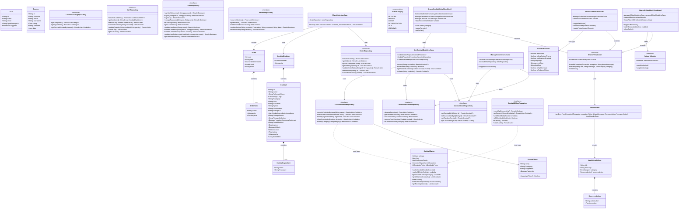

# Class Diagram

```mermaid
classDiagram
    %% Domain Models
    class Cocktail {
        +String id
        +String name
        +String? alternateName
        +List~String~? tags
        +String? category
        +String? iba
        +String? alcoholic
        +String? glass
        +String? instructions
        +String? imageUrl
        +List~CocktailIngredient~ ingredients
        +String? imageSource
        +String? imageAttribution
        +Boolean? creativeCommonsConfirmed
        +String? dateModified
        +Double price
        +Boolean inStock
        +Int stockCount
        +Float rating
        +Int popularity
        +Long dateAdded
    }

    class CocktailIngredient {
        +String name
        +String? measure
    }

    class CocktailCartItem {
        +Cocktail cocktail
        +Int quantity
    }

    class Order {
        +String id
        +String date
        +List~OrderItem~ items
        +Double total
        +String status
    }

    class OrderItem {
        +String name
        +Int quantity
        +Double price
    }

    class User {
        +String id
        +String name
        +String email
        +String? profileImageUrl
        +Boolean isLoggedIn
    }

    class Review {
        +String id
        +String cocktailId
        +String userId
        +String userName
        +Float rating
        +String comment
        +Long date
    }

    class UserPreferences {
        +Boolean darkMode
        +Boolean followSystemTheme
        +Boolean notificationsEnabled
        +String language
        +String accentColor
        +String fontSize
        +Boolean isHighContrast
        +Boolean isReducedMotion
    }

    class SearchFilters {
        +String query
        +String? category
        +String? ingredient
        +Boolean? alcoholic
        +hasActiveFilters() Boolean
    }

    %% Repository Interfaces — the former monolithic CocktailRepository
    %% was split into these five plus the four store repositories below.
    %% Methods are suspend and return Result~T~ unless noted.
    class CocktailSearchRepository {
        <<interface>>
        +searchCocktailsByName(String name) Result~List~Cocktail~~
        +advancedSearch(SearchFilters filters) Result~List~Cocktail~~
        +filterByIngredient(String ingredient) Result~List~Cocktail~~
        +filterByAlcoholic(Boolean alcoholic) Result~List~Cocktail~~
        +filterByCategory(String category) Result~List~Cocktail~~
    }

    class CocktailDetailRepository {
        <<interface>>
        +getCocktailById(String id) Result~Cocktail?~
        +refreshCocktailById(String id) Result~Cocktail?~
        +getRandomCocktail() Result~Cocktail?~
        +getCocktailImageUrl(Cocktail cocktail) String
    }

    class CocktailCatalogRepository {
        <<interface>>
        +getCategories() Result~List~String~~
        +getIngredients() Result~List~String~~
        +getCocktailsSortedByNewest() Result~List~Cocktail~~
    }

    class CocktailFavoritesRepository {
        <<interface>>
        +observeFavorites() Flow~List~Cocktail~~
        +getFavoriteCocktails() Result~List~Cocktail~~
        +addToFavorites(Cocktail cocktail) Result~Unit~
        +removeFromFavorites(Cocktail cocktail) Result~Unit~
        +isCocktailFavorite(String id) Result~Boolean~
    }

    class CocktailOfflineRepository {
        <<interface>>
        +checkApiConnectivity() Result~Boolean~
        +getRecentlyViewedCocktails() Result~List~Cocktail~~
        +setOfflineMode(Boolean enabled)
        +isOfflineModeEnabled() Boolean
        +isOffline() Boolean
        +clearCache() Result~Unit~
    }

    class CartRepository {
        <<interface>>
        +observeCartItems() Flow~List~CocktailCartItem~~
        +getCartItems() Result~List~CocktailCartItem~~
        +addToCart(CocktailCartItem item) Result~Unit~
        +removeFromCart(String cocktailId) Result~Unit~
        +updateQuantity(String cocktailId, Int quantity) Result~Unit~
        +clearCart() Result~Unit~
        +getCartTotal() Result~Double~
    }

    class OrderRepository {
        <<interface>>
        +observeOrders() Flow~List~Order~~
        +getOrders() Result~List~Order~~
        +placeOrder(Order order) Result~Unit~
        +getOrderById(String id) Result~Order?~
        +updateOrderStatus(String id, String status) Result~Unit~
        +deleteOrder(String id) Result~Unit~
        +cancelOrder(String orderId) Result~Boolean~
    }

    class AuthRepository {
        <<interface>>
        +signUp(String email, String password) Result~Boolean~
        +signIn(String email, String password) Result~Boolean~
        +signOut() Result~Boolean~
        +changePassword(String old, String new) Result~Boolean~
        +isUserSignedIn() Result~Boolean~
        +getCurrentUser() Result~User?~
        +updateUserName(String name) Result~Boolean~
        +updateUserEmail(String email, String password) Result~Boolean~
        +updateUserAddress(Address address) Result~Boolean~
        +updateUserPreferences(UserPreferences preferences) Result~Boolean~
        +getUserPreferences() Result~UserPreferences~
    }

    class ReviewRepository {
        <<interface>>
        +observeReviews() Flow~List~Review~~
        +getReviews() Result~List~Review~~
        +addReview(Review review) Result~Unit~
        +updateReview(String reviewId, Float rating, String comment, String date) Result~Boolean~
        +deleteReview(String reviewId) Result~Boolean~
    }

    %% Use Cases (representative — 12 in domain/usecase/)
    class PlaceOrderUseCase {
        -OrderRepository orderRepository
        +invoke(List~CocktailCartItem~ cartItems, Double totalPrice) Result~Order~
    }

    class ManageFavoritesUseCase {
        -CocktailFavoritesRepository favoritesRepository
        -CocktailDetailRepository detailRepository
        +toggle(Cocktail cocktail)
    }

    class GetCocktailDetailUseCase {
        -CocktailDetailRepository detailRepository
        -CocktailFavoritesRepository favoritesRepository
        -CocktailSearchRepository searchRepository
        +invoke(String cocktailId) Result~Cocktail?~
        +isFavorite(String cocktailId) Boolean
        +getRelatedCocktails(Cocktail cocktail, Int limit) List~Cocktail~
        +refresh(String cocktailId) Result~Cocktail?~
    }

    %% Utility Classes
    class NetworkMonitor {
        <<interface>>
        +startMonitoring()
        +stopMonitoring()
        +isOnline: StateFlow~Boolean~
    }

    class CocktailCache {
        -Settings settings
        -Json json
        -AppConfig appConfig
        -CoroutineDispatcher ioDispatcher
        -OfflineModePolicy offlineModePolicy
        +cacheCocktail(Cocktail cocktail)
        +cacheAll(List~Cocktail~ cocktails)
        +getCachedCocktail(String id) Cocktail?
        +getAllCachedCocktails() List~Cocktail~
        +clearCache()
        +addToRecentlyViewed(Cocktail cocktail)
        +getRecentlyViewed() List~Cocktail~
    }

    class ErrorHandler {
        +getErrorFromException(Throwable exception, String defaultMessage, RecoveryAction? recoveryAction) UserFriendlyError
    }

    class UserFriendlyError {
        +String title
        +String message
        +ErrorCategory category
        +RecoveryAction? recoveryAction
    }

    class RecoveryAction {
        +String actionLabel
        +Function action
    }

    class ErrorCategory {
        <<enumeration>>
        NETWORK
        SERVER
        CLIENT
        AUTHENTICATION
        DATA
        UNKNOWN
    }

    %% Shared ViewModels (consumed by both platforms)
    class SharedViewModel {
        <<abstract>>
        +StateFlow~UserFriendlyError?~ error
        #handleException(Throwable exception, String defaultMessage)
        #setError(String title, String message, ErrorCategory category)
        +clearError()
    }

    class SharedThemeViewModel {
        -ManageProfileUseCase manageProfileUseCase
        +StateFlow~ThemeUiState~ uiState
        +toggleDarkMode()
        +setDarkMode(Boolean enabled)
        +toggleFollowSystemTheme()
    }

    class SharedOfflineModeViewModel {
        -ManageOfflineModeUseCase manageOfflineModeUseCase
        -NetworkMonitor networkMonitor
        +StateFlow~OfflineModeUiState~ uiState
        +toggleOfflineMode()
        +setOfflineMode(Boolean enabled)
        +clearCache()
    }

    class SharedCocktailDetailViewModel {
        -GetCocktailDetailUseCase getCocktailDetailUseCase
        -ManageFavoritesUseCase manageFavoritesUseCase
        -ManageCartUseCase manageCartUseCase
        +StateFlow~DetailUiState~ uiState
        +loadCocktail(String id)
        +toggleFavorite()
        +addToCart()
    }

    %% Relationships
    Cocktail "1" *-- "many" CocktailIngredient : contains
    CocktailCartItem "1" *-- "1" Cocktail : contains
    Order "1" *-- "many" OrderItem : contains

    PlaceOrderUseCase --> OrderRepository : uses
    PlaceOrderUseCase --> CocktailCartItem : uses
    PlaceOrderUseCase --> Order : creates
    ManageFavoritesUseCase --> CocktailFavoritesRepository : uses
    ManageFavoritesUseCase --> CocktailDetailRepository : uses
    GetCocktailDetailUseCase --> CocktailDetailRepository : uses
    GetCocktailDetailUseCase --> CocktailFavoritesRepository : uses
    GetCocktailDetailUseCase --> CocktailSearchRepository : uses

    SharedViewModel --> ErrorHandler : uses
    SharedThemeViewModel --|> SharedViewModel : extends
    SharedOfflineModeViewModel --|> SharedViewModel : extends
    SharedCocktailDetailViewModel --|> SharedViewModel : extends

    SharedThemeViewModel --> UserPreferences : manages
    SharedOfflineModeViewModel --> NetworkMonitor : uses
    SharedCocktailDetailViewModel --> GetCocktailDetailUseCase : uses

    CocktailSearchRepository --> SearchFilters : uses
    CocktailSearchRepository ..> CocktailCache : impl uses
    CocktailOfflineRepository ..> CocktailCache : impl uses

    ErrorHandler --> UserFriendlyError : creates
    UserFriendlyError *-- RecoveryAction : contains
```

This diagram shows the key domain models and their relationships in the CocktailCraft application, including:

1. **Domain Models**: Cocktail, CocktailIngredient, CocktailCartItem, Order, OrderItem, User, Review, UserPreferences (theme + accessibility settings), and SearchFilters (advanced search)
2. **Repository Interfaces**: the nine focused interfaces — the former monolithic `CocktailRepository` was split into Search/Detail/Catalog/Favorites/Offline, alongside Cart/Order/Auth/Review. Methods are `suspend` and return `Result<T>`; mutable stores also expose `observe*()` Flows
3. **Use Cases**: PlaceOrderUseCase, ManageFavoritesUseCase, and GetCocktailDetailUseCase shown as representative examples (12 total in `domain/usecase/`); related-cocktail recommendations live in `GetCocktailDetailUseCase.getRelatedCocktails`
4. **Utility Classes**: NetworkMonitor for connectivity tracking, CocktailCache for offline mode, and ErrorHandler for error classification
5. **Shared ViewModels**: `SharedViewModel` base class (error channel) with constructor-injected use cases; each screen has a consolidated `UiState` flow

The diagram shows the relationships between these classes, including inheritance, composition, and dependencies. The interface KDoc in `shared/src/commonMain/kotlin/com/cocktailcraft/domain/repository/` is the source of truth for exact signatures.
