# Class Diagram

```mermaid
classDiagram
    %% Domain Models
    class Cocktail {
        +String id
        +String name
        +String? alternateName
        +List~String~? tags
        +String? category
        +String? iba
        +String? alcoholic
        +String? glass
        +String? instructions
        +String? imageUrl
        +List~CocktailIngredient~ ingredients
        +String? imageSource
        +String? imageAttribution
        +Boolean? creativeCommonsConfirmed
        +String? dateModified
        +Double price
        +Boolean inStock
        +Int stockCount
        +Float rating
        +Int popularity
        +Long dateAdded
    }

    class CocktailIngredient {
        +String name
        +String? measure
    }

    class CocktailCartItem {
        +Cocktail cocktail
        +Int quantity
    }

    class Order {
        +String id
        +String date
        +List~OrderItem~ items
        +Double total
        +String status
    }

    class OrderItem {
        +String name
        +Int quantity
        +Double price
    }

    class User {
        +String id
        +String name
        +String email
        +String? profileImageUrl
        +Boolean isLoggedIn
    }

    class Review {
        +String id
        +String cocktailId
        +String userId
        +String userName
        +Float rating
        +String comment
        +Long date
    }

    class UserPreferences {
        +Boolean darkMode
        +Boolean followSystemTheme
        +Boolean offlineMode
        +Long lastCacheUpdate
    }

    class SortOption {
        <<enumeration>>
        NEWEST
        PRICE_LOW_TO_HIGH
        PRICE_HIGH_TO_LOW
        POPULARITY
    }

    %% Repository Interfaces
    class CocktailRepository {
        <<interface>>
        +searchCocktailsByName(String name): Flow~List~Cocktail~~
        +searchCocktailsByFirstLetter(Char letter): Flow~List~Cocktail~~
        +getCocktailById(String id): Flow~Cocktail?~
        +getRandomCocktail(): Flow~Cocktail?~
        +filterByIngredient(String ingredient): Flow~List~Cocktail~~
        +filterByAlcoholic(Boolean alcoholic): Flow~List~Cocktail~~
        +filterByCategory(String category): Flow~List~Cocktail~~
        +filterByGlass(String glass): Flow~List~Cocktail~~
        +getCategories(): Flow~List~String~~
        +getGlasses(): Flow~List~String~~
        +getIngredients(): Flow~List~String~~
        +getAlcoholicFilters(): Flow~List~String~~
        +getFavoriteCocktails(): Flow~List~Cocktail~~
        +addToFavorites(Cocktail cocktail)
        +removeFromFavorites(Cocktail cocktail)
        +isCocktailFavorite(String id): Flow~Boolean~
        +getCocktailsSortedByNewest(): Flow~List~Cocktail~~
        +getCocktailsSortedByPriceLowToHigh(): Flow~List~Cocktail~~
        +getCocktailsSortedByPriceHighToLow(): Flow~List~Cocktail~~
        +getCocktailsSortedByPopularity(): Flow~List~Cocktail~~
        +getCocktailsByPriceRange(Double minPrice, Double maxPrice): Flow~List~Cocktail~~
        +getCocktailImageUrl(Cocktail cocktail): String
        +checkApiConnectivity(): Flow~Boolean~
        +isOfflineModeEnabled(): Boolean
        +setOfflineMode(Boolean enabled)
        +getCocktailsByIngredient(String ingredient): List~Cocktail~
        +getCocktailsByCategory(String category): List~Cocktail~
        +getRecentlyViewedCocktails(): Flow~List~Cocktail~~
        +clearCache()
    }

    class CartRepository {
        <<interface>>
        +getCartItems(): Flow~List~CocktailCartItem~~
        +addToCart(CocktailCartItem item)
        +removeFromCart(String cocktailId)
        +updateQuantity(String cocktailId, Int quantity)
        +clearCart()
        +getCartTotal(): Flow~Double~
    }

    class OrderRepository {
        <<interface>>
        +getOrders(): Flow~List~Order~~
        +getOrderById(String id): Flow~Order?~
        +addOrder(Order order)
        +updateOrderStatus(String orderId, String status)
    }

    class AuthRepository {
        <<interface>>
        +getCurrentUser(): Flow~User?~
        +login(String email, String password): Flow~Result~User~~
        +register(String name, String email, String password): Flow~Result~User~~
        +logout(): Flow~Result~Unit~~
        +isLoggedIn(): Flow~Boolean~
        +getUserPreferences(): Flow~UserPreferences~
        +updateUserPreferences(UserPreferences preferences)
    }

    class FavoritesRepository {
        <<interface>>
        +getFavorites(): Flow~List~Cocktail~~
        +addFavorite(Cocktail cocktail)
        +removeFavorite(String cocktailId)
        +isFavorite(String cocktailId): Flow~Boolean~
    }

    %% Use Cases
    class PlaceOrderUseCase {
        -OrderRepository orderRepository
        +invoke(List~CocktailCartItem~ cartItems, Double totalPrice): Flow~Result~Order~~
    }

    class ToggleFavoriteUseCase {
        -CocktailRepository cocktailRepository
        +invoke(Cocktail cocktail, Boolean isFavorite): Flow~Result~Boolean~~
    }

    %% Utility Classes
    class NetworkMonitor {
        +startMonitoring()
        +stopMonitoring()
        +isOnline: StateFlow~Boolean~
    }

    class CocktailCache {
        -Settings settings
        -Json json
        -AppConfig appConfig
        +cacheCocktail(Cocktail cocktail)
        +getCachedCocktail(String id): Cocktail?
        +getAllCachedCocktails(): List~Cocktail~
        +clearCache()
        +addToRecentlyViewed(Cocktail cocktail)
        +getRecentlyViewed(): List~Cocktail~
    }

    class ErrorUtils {
        <<static>>
        +getErrorFromException(Exception exception, String defaultMessage): UserFriendlyError
        +createNetworkError(Function retryAction): UserFriendlyError
        +createErrorFromErrorCode(ErrorCode errorCode): UserFriendlyError
    }

    class UserFriendlyError {
        +String title
        +String message
        +ErrorCategory category
        +RecoveryAction? recoveryAction
        +Throwable? originalException
        +ErrorCode errorCode
    }

    class RecoveryAction {
        +String actionLabel
        +Function action
    }

    class ErrorCategory {
        <<enumeration>>
        NETWORK
        SERVER
        CLIENT
        AUTHENTICATION
        DATA
        UNKNOWN
    }

    %% ViewModels
    class BaseViewModel {
        #MutableStateFlow~Boolean~ _isLoading
        #MutableStateFlow~UserFriendlyError?~ _error
        #MutableSharedFlow~UserFriendlyError~ _errorEvent
        +StateFlow~Boolean~ isLoading
        +StateFlow~UserFriendlyError?~ error
        +SharedFlow~UserFriendlyError~ errorEvent
        #setLoading(Boolean loading)
        #handleException(Throwable exception, String defaultMessage)
        #setError(String title, String message, ErrorCategory category)
        +clearError()
        #executeWithErrorHandling(Function operation, Function onSuccess)
    }

    class ThemeViewModel {
        -AuthRepository repository
        -MutableStateFlow~Boolean~ _isDarkMode
        -MutableStateFlow~Boolean~ _followSystemTheme
        -MutableStateFlow~Boolean~ _isSystemInDarkMode
        +StateFlow~Boolean~ isDarkMode
        +StateFlow~Boolean~ followSystemTheme
        +updateSystemDarkMode(Boolean isDark)
        +toggleDarkMode()
        +setDarkMode(Boolean enabled)
        +toggleFollowSystemTheme()
        -loadThemePreference()
    }

    class OfflineModeViewModel {
        -CocktailRepository cocktailRepository
        -NetworkMonitor networkMonitor
        -MutableStateFlow~Boolean~ _isOfflineModeEnabled
        -MutableStateFlow~Boolean~ _isNetworkAvailable
        -MutableStateFlow~List~Cocktail~~ _recentlyViewedCocktails
        +StateFlow~Boolean~ isOfflineModeEnabled
        +StateFlow~Boolean~ isNetworkAvailable
        +StateFlow~List~Cocktail~~ recentlyViewedCocktails
        +toggleOfflineMode()
        +setOfflineMode(Boolean enabled)
        +clearCache()
        -loadRecentlyViewedCocktails()
    }

    %% Recommendation System
    class CocktailRecommendationEngine {
        -CocktailRepository cocktailRepository
        -FavoritesRepository favoritesRepository
        +getRecommendations(Cocktail cocktail, Int limit): List~Cocktail~
        -getCocktailsByCategory(String category, Set~String~ excludeIds): List~Cocktail~
        -getCocktailsByIngredient(String ingredient, Set~String~ excludeIds): List~Cocktail~
        -getCocktailsByAlcoholicFilter(String alcoholicFilter, Set~String~ excludeIds): List~Cocktail~
        -getFallbackRecommendations(Set~String~ excludeIds): List~Cocktail~
    }

    %% Relationships
    Cocktail "1" *-- "many" CocktailIngredient : contains
    CocktailCartItem "1" *-- "1" Cocktail : contains
    Order "1" *-- "many" OrderItem : contains

    PlaceOrderUseCase --> OrderRepository : uses
    PlaceOrderUseCase --> CocktailCartItem : uses
    PlaceOrderUseCase --> Order : creates
    ToggleFavoriteUseCase --> CocktailRepository : uses
    ToggleFavoriteUseCase --> Cocktail : uses

    BaseViewModel --> ErrorUtils : uses
    ThemeViewModel --|> BaseViewModel : extends
    OfflineModeViewModel --|> BaseViewModel : extends

    ThemeViewModel --> AuthRepository : uses
    ThemeViewModel --> UserPreferences : manages

    OfflineModeViewModel --> CocktailRepository : uses
    OfflineModeViewModel --> NetworkMonitor : uses

    CocktailRecommendationEngine --> CocktailRepository : uses
    CocktailRecommendationEngine --> FavoritesRepository : uses

    CocktailRepository --> CocktailCache : uses
    CocktailRepository --> NetworkMonitor : uses

    ErrorUtils --> UserFriendlyError : creates
    UserFriendlyError *-- RecoveryAction : contains
```

This diagram shows the key domain models and their relationships in the CocktailCraft application, including:

1. **Domain Models**: Cocktail, CocktailIngredient, CocktailCartItem, Order, OrderItem, User, Review, and the new UserPreferences model for theme and offline settings
2. **Repository Interfaces**: Extended with new methods for offline mode, caching, and recommendations
3. **Use Cases**: PlaceOrderUseCase and ToggleFavoriteUseCase
4. **Utility Classes**: NetworkMonitor for connectivity tracking, CocktailCache for offline mode, and ErrorUtils for error handling
5. **ViewModels**: BaseViewModel with error handling, ThemeViewModel for dark mode, and OfflineModeViewModel
6. **Recommendation System**: CocktailRecommendationEngine for generating cocktail recommendations

The diagram shows the relationships between these classes, including inheritance, composition, and dependencies.