# Component Diagram

```mermaid
graph TD
    %% UI Layer
    subgraph UI["UI Layer"]
        Main["MainScreen"]
        Home["HomeScreen"]
        Cart["CartScreen"]
        Favorites["FavoritesScreen"]
        Profile["ProfileScreen"]
        OrderList["OrderListScreen"]
        Detail["CocktailDetailScreen"]
        UIComp["UI Components"]
    end

    %% Navigation
    subgraph Nav["Navigation"]
        NavManager["NavigationManager"]
        Screens["Screen Definitions"]
    end

    %% ViewModel Layer
    subgraph VM["ViewModel Layer"]
        HomeVM["HomeViewModel"]
        CartVM["CartViewModel"]
        FavVM["FavoritesViewModel"]
        ProfileVM["ProfileViewModel"]
        OrderVM["OrderViewModel"]
        ReviewVM["ReviewViewModel"]
    end

    %% Domain Layer
    subgraph Domain["Domain Layer"]
        subgraph Repos["Repository Interfaces"]
            CocktailRepo["CocktailRepository"]
            CartRepo["CartRepository"]
            OrderRepo["OrderRepository"]
            AuthRepo["AuthRepository"]
        end
        
        subgraph UseCases["Use Cases"]
            PlaceOrderUC["PlaceOrderUseCase"]
            ToggleFavoriteUC["ToggleFavoriteUseCase"]
        end
        
        subgraph Models["Models"]
            CocktailModel["Cocktail"]
            CartItemModel["CocktailCartItem"]
            OrderModel["Order"]
            UserModel["User"]
            ReviewModel["Review"]
        end
    end

    %% Data Layer
    subgraph Data["Data Layer"]
        CocktailRepoImpl["CocktailRepositoryImpl"]
        CartRepoImpl["CartRepositoryImpl"]
        OrderRepoImpl["OrderRepositoryImpl"]
        AuthRepoImpl["AuthRepositoryImpl"]
        
        CocktailApiInt["CocktailApi"]
        CocktailApiImpl["CocktailApiImpl"]
        
        LocalStorage["Local Storage"]
    end

    %% DI
    subgraph DI["Dependency Injection"]
        AppModule["AppModule"]
        PlatformModule["PlatformModule"]
    end

    %% UI Layer Relationships
    Main --> Home
    Main --> Cart
    Main --> Favorites
    Main --> Profile
    Main --> OrderList
    Main --> Detail
    Home --> UIComp
    Cart --> UIComp
    Favorites --> UIComp
    Detail --> UIComp

    %% Navigation Relationships
    Main --> NavManager
    NavManager --> Screens

    %% ViewModel Relationships
    Home --> HomeVM
    Cart --> CartVM
    Favorites --> FavVM
    Profile --> ProfileVM
    OrderList --> OrderVM
    Detail --> ReviewVM

    %% Domain Layer Relationships
    HomeVM --> CocktailRepo
    CartVM --> CartRepo
    FavVM --> CocktailRepo
    OrderVM --> OrderRepo
    ProfileVM --> AuthRepo
    ReviewVM --> CocktailRepo

    PlaceOrderUC --> OrderRepo
    ToggleFavoriteUC --> CocktailRepo

    %% Data Layer Relationships
    CocktailRepoImpl --> CocktailRepo
    CartRepoImpl --> CartRepo
    OrderRepoImpl --> OrderRepo
    AuthRepoImpl --> AuthRepo

    CocktailRepoImpl --> CocktailApiInt
    CocktailRepoImpl --> LocalStorage
    CartRepoImpl --> LocalStorage
    OrderRepoImpl --> LocalStorage
    AuthRepoImpl --> LocalStorage

    CocktailApiImpl --> CocktailApiInt

    %% DI Relationships
    AppModule --> CocktailApiImpl
    AppModule --> CocktailRepoImpl
    AppModule --> CartRepoImpl
    AppModule --> OrderRepoImpl
    AppModule --> AuthRepoImpl
    AppModule --> PlaceOrderUC
    AppModule --> ToggleFavoriteUC
    PlatformModule --> LocalStorage
```

This diagram shows the main components of the CocktailCraft application and their relationships, including UI components, ViewModels, Domain layer (repositories, use cases, models), and Data layer (repository implementations, API, local storage).