# Component Diagram

```mermaid
graph TD
    %% UI Layer
    subgraph UI["UI Layer"]
        Main["MainScreen"]
        Home["HomeScreen"]
        Cart["CartScreen"]
        Favorites["FavoritesScreen"]
        Profile["ProfileScreen"]
        OrderList["OrderListScreen"]
        Detail["CocktailDetailScreen"]
        Offline["OfflineModeScreen"]
        UIComp["UI Components"]
        ErrorComp["Error Components"]
        ThemeComp["Theme Components"]
    end

    %% Navigation
    subgraph Nav["Navigation"]
        NavManager["NavigationManager"]
        Screens["Screen Definitions"]
    end

    %% ViewModel Layer
    subgraph VM["ViewModel Layer"]
        BaseVM["BaseViewModel"]
        HomeVM["HomeViewModel"]
        CartVM["CartViewModel"]
        FavVM["FavoritesViewModel"]
        ProfileVM["ProfileViewModel"]
        OrderVM["OrderViewModel"]
        ReviewVM["ReviewViewModel"]
        DetailVM["CocktailDetailViewModel"]
        ThemeVM["ThemeViewModel"]
        OfflineVM["OfflineModeViewModel"]
    end

    %% Domain Layer
    subgraph Domain["Domain Layer"]
        subgraph Repos["Repository Interfaces"]
            CocktailRepo["CocktailRepository"]
            CartRepo["CartRepository"]
            OrderRepo["OrderRepository"]
            AuthRepo["AuthRepository"]
            FavRepo["FavoritesRepository"]
        end

        subgraph UseCases["Use Cases"]
            PlaceOrderUC["PlaceOrderUseCase"]
            ToggleFavoriteUC["ToggleFavoriteUseCase"]
        end

        subgraph Models["Models"]
            CocktailModel["Cocktail"]
            CartItemModel["CocktailCartItem"]
            OrderModel["Order"]
            UserModel["User"]
            ReviewModel["Review"]
        end

        subgraph Recommendation["Recommendation System"]
            RecEngine["CocktailRecommendationEngine"]
        end
    end

    %% Data Layer
    subgraph Data["Data Layer"]
        CocktailRepoImpl["CocktailRepositoryImpl"]
        CartRepoImpl["CartRepositoryImpl"]
        OrderRepoImpl["OrderRepositoryImpl"]
        AuthRepoImpl["AuthRepositoryImpl"]
        FavRepoImpl["FavoritesRepositoryImpl"]

        CocktailApiInt["CocktailApi"]
        CocktailApiImpl["CocktailApiImpl"]

        LocalStorage["Local Storage"]
        CocktailCache["CocktailCache"]
        NetworkMonitor["NetworkMonitor"]
        ErrorUtils["ErrorUtils"]
        AppConfig["AppConfig"]
    end

    %% DI
    subgraph DI["Dependency Injection"]
        AppModule["AppModule"]
        DataModule["DataModule"]
        DomainModule["DomainModule"]
        NetworkModule["NetworkModule"]
        PlatformModule["PlatformModule"]
        RecommendationModule["RecommendationModule"]
    end

    %% UI Layer Relationships
    Main --> Home
    Main --> Cart
    Main --> Favorites
    Main --> Profile
    Main --> OrderList
    Main --> Detail
    Main --> Offline
    Home --> UIComp
    Cart --> UIComp
    Favorites --> UIComp
    Detail --> UIComp
    Profile --> ThemeComp
    Offline --> UIComp
    UIComp --> ErrorComp
    UIComp --> ThemeComp

    %% Navigation Relationships
    Main --> NavManager
    NavManager --> Screens

    %% ViewModel Relationships
    BaseVM --> ErrorUtils
    HomeVM --> BaseVM
    CartVM --> BaseVM
    FavVM --> BaseVM
    ProfileVM --> BaseVM
    OrderVM --> BaseVM
    ReviewVM --> BaseVM
    DetailVM --> BaseVM
    OfflineVM --> BaseVM

    Home --> HomeVM
    Cart --> CartVM
    Favorites --> FavVM
    Profile --> ProfileVM
    Profile --> ThemeVM
    OrderList --> OrderVM
    Detail --> DetailVM
    Detail --> ReviewVM
    Offline --> OfflineVM

    %% Domain Layer Relationships
    HomeVM --> CocktailRepo
    CartVM --> CartRepo
    FavVM --> CocktailRepo
    FavVM --> FavRepo
    OrderVM --> OrderRepo
    ProfileVM --> AuthRepo
    ReviewVM --> CocktailRepo
    DetailVM --> CocktailRepo
    DetailVM --> RecEngine
    OfflineVM --> CocktailRepo
    OfflineVM --> NetworkMonitor
    ThemeVM --> AuthRepo

    PlaceOrderUC --> OrderRepo
    ToggleFavoriteUC --> CocktailRepo
    RecEngine --> CocktailRepo
    RecEngine --> FavRepo

    %% Data Layer Relationships
    CocktailRepoImpl --> CocktailRepo
    CartRepoImpl --> CartRepo
    OrderRepoImpl --> OrderRepo
    AuthRepoImpl --> AuthRepo
    FavRepoImpl --> FavRepo

    CocktailRepoImpl --> CocktailApiInt
    CocktailRepoImpl --> LocalStorage
    CocktailRepoImpl --> CocktailCache
    CocktailRepoImpl --> NetworkMonitor
    CocktailRepoImpl --> AppConfig
    CartRepoImpl --> LocalStorage
    OrderRepoImpl --> LocalStorage
    AuthRepoImpl --> LocalStorage
    FavRepoImpl --> LocalStorage
    FavRepoImpl --> CocktailRepo

    CocktailApiImpl --> CocktailApiInt
    CocktailCache --> LocalStorage

    %% DI Relationships
    AppModule --> DataModule
    AppModule --> DomainModule
    AppModule --> NetworkModule

    NetworkModule --> CocktailApiImpl
    NetworkModule --> NetworkMonitor

    DataModule --> CocktailRepoImpl
    DataModule --> CartRepoImpl
    DataModule --> OrderRepoImpl
    DataModule --> AuthRepoImpl
    DataModule --> FavRepoImpl
    DataModule --> CocktailCache

    DomainModule --> PlaceOrderUC
    DomainModule --> ToggleFavoriteUC
    DomainModule --> AppConfig

    RecommendationModule --> RecEngine
    RecommendationModule --> DetailVM

    PlatformModule --> LocalStorage
```

This diagram shows the main components of the CocktailCraft application and their relationships, including:

1. **UI Layer**: All screens and UI components, including new components for Error Handling, Theme System (Dark Mode), and Offline Mode
2. **ViewModel Layer**: All ViewModels, including new ones for Theme management, Offline Mode, and Cocktail Detail with recommendations
3. **Domain Layer**: Repository interfaces, Use Cases, Models, and the new Recommendation System
4. **Data Layer**: Repository implementations, API interfaces and implementations, Local Storage, Caching System for Offline Mode, Network Monitor, Error Utilities, and App Configuration
5. **Dependency Injection**: Modular Koin setup with specialized modules for different concerns

The diagram shows how these components interact with each other, with special attention to the new features like Dark Mode, Offline Mode, Error Handling, and the Recommendation System.