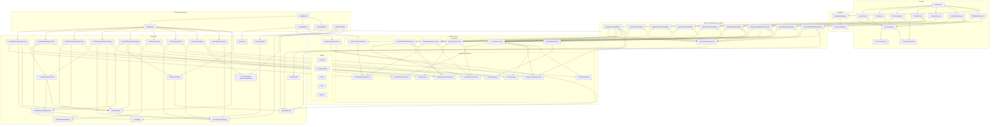

# Component Diagram

```mermaid
graph TD
    %% UI Layer (Android Compose; iOS SwiftUI mirrors the same structure
    %% through thin *SKIE wrappers over the same shared ViewModels)
    subgraph UI["UI Layer"]
        Main["MainScreen"]
        Home["HomeScreen"]
        Cart["CartScreen"]
        Favorites["FavoritesScreen"]
        Profile["ProfileScreen"]
        OrderList["OrderListScreen"]
        Detail["CocktailDetailScreen"]
        Offline["OfflineModeScreen"]
        UIComp["UI Components"]
        ErrorComp["Error Components"]
        ThemeComp["Theme Components"]
    end

    %% Navigation
    subgraph Nav["Navigation"]
        NavManager["NavigationManager"]
        Screens["Screen Definitions"]
    end

    %% Shared ViewModel Layer (Kotlin Multiplatform)
    subgraph VM["Shared ViewModel Layer (KMP)"]
        BaseVM["SharedViewModel (base)"]
        HomeVM["SharedHomeViewModel"]
        CartVM["SharedCartViewModel"]
        FavVM["SharedFavoritesViewModel"]
        ProfileVM["SharedProfileViewModel"]
        OrderVM["SharedOrderViewModel"]
        ReviewVM["SharedReviewViewModel"]
        DetailVM["SharedCocktailDetailViewModel"]
        ThemeVM["SharedThemeViewModel"]
        OfflineVM["SharedOfflineModeViewModel"]
    end

    %% Domain Layer
    subgraph Domain["Domain Layer"]
        subgraph Repos["Repository Interfaces"]
            SearchRepo["CocktailSearchRepository"]
            DetailRepo["CocktailDetailRepository"]
            CatalogRepo["CocktailCatalogRepository"]
            FavRepo["CocktailFavoritesRepository"]
            OfflineRepo["CocktailOfflineRepository"]
            CartRepo["CartRepository"]
            OrderRepo["OrderRepository"]
            AuthRepo["AuthRepository"]
            ReviewRepo["ReviewRepository"]
        end

        subgraph UseCases["Use Cases"]
            SearchUC["SearchCocktailsUseCase"]
            DetailUC["GetCocktailDetailUseCase"]
            FavUC["ManageFavoritesUseCase"]
            CartUC["ManageCartUseCase"]
            PlaceOrderUC["PlaceOrderUseCase"]
            OtherUC["... 7 more use cases"]
        end

        subgraph Models["Models"]
            CocktailModel["Cocktail"]
            CartItemModel["CocktailCartItem"]
            OrderModel["Order"]
            UserModel["User"]
            ReviewModel["Review"]
        end

        SyncService["BackgroundSyncService"]
    end

    %% Data Layer
    subgraph Data["Data Layer"]
        SearchRepoImpl["CocktailSearchRepositoryImpl"]
        DetailRepoImpl["CocktailDetailRepositoryImpl"]
        CatalogRepoImpl["CocktailCatalogRepositoryImpl"]
        FavRepoImpl["CocktailFavoritesRepositoryImpl"]
        OfflineRepoImpl["CocktailOfflineRepositoryImpl"]
        CartRepoImpl["CartRepositoryImpl"]
        OrderRepoImpl["OrderRepositoryImpl"]
        AuthRepoImpl["AuthRepositoryImpl"]
        ReviewRepoImpl["ReviewRepositoryImpl"]
        CategoryFetcher["CocktailCategoryFetcher"]

        CocktailApiInt["CocktailApi"]
        CocktailApiImpl["CocktailApiImpl"]
        RemoteDataSource["CocktailRemoteDataSource"]

        LocalStorage["Local Storage (Settings)"]
        SecureStorage["Secure Storage (Keystore/Keychain)"]
        CocktailCache["CocktailCache"]
        CacheManager["CocktailCacheManager"]
        OfflinePolicy["OfflineModePolicy"]
        NetworkMonitor["NetworkMonitor"]
        ErrorHandler["ErrorHandler"]
        AppConfig["AppConfig"]
    end

    %% DI
    subgraph DI["Dependency Injection"]
        AppModule["AppModule"]
        DataModule["DataModule"]
        DomainModule["DomainModule"]
        NetworkModule["NetworkModule"]
        PlatformModule["PlatformModule"]
    end

    %% UI Layer Relationships
    Main --> Home
    Main --> Cart
    Main --> Favorites
    Main --> Profile
    Main --> OrderList
    Main --> Detail
    Main --> Offline
    Home --> UIComp
    Cart --> UIComp
    Favorites --> UIComp
    Detail --> UIComp
    Profile --> ThemeComp
    Offline --> UIComp
    UIComp --> ErrorComp
    UIComp --> ThemeComp

    %% Navigation Relationships
    Main --> NavManager
    NavManager --> Screens

    %% ViewModel Relationships
    BaseVM --> ErrorHandler
    HomeVM --> BaseVM
    CartVM --> BaseVM
    FavVM --> BaseVM
    ProfileVM --> BaseVM
    OrderVM --> BaseVM
    ReviewVM --> BaseVM
    DetailVM --> BaseVM
    ThemeVM --> BaseVM
    OfflineVM --> BaseVM

    Home --> HomeVM
    Cart --> CartVM
    Favorites --> FavVM
    Profile --> ProfileVM
    Profile --> ThemeVM
    OrderList --> OrderVM
    Detail --> DetailVM
    Detail --> ReviewVM
    Offline --> OfflineVM

    %% ViewModels depend on use cases (not repositories directly)
    HomeVM --> SearchUC
    HomeVM --> DetailUC
    HomeVM --> FavUC
    HomeVM --> OtherUC
    HomeVM --> CatalogRepo
    HomeVM --> NetworkMonitor
    CartVM --> CartUC
    FavVM --> FavUC
    OrderVM --> PlaceOrderUC
    OrderVM --> OtherUC
    ProfileVM --> OtherUC
    ThemeVM --> OtherUC
    ReviewVM --> OtherUC
    DetailVM --> DetailUC
    DetailVM --> FavUC
    DetailVM --> CartUC
    OfflineVM --> OtherUC
    OfflineVM --> NetworkMonitor

    %% Use cases depend on the focused repository interfaces
    SearchUC --> SearchRepo
    DetailUC --> DetailRepo
    DetailUC --> FavRepo
    DetailUC --> SearchRepo
    FavUC --> FavRepo
    FavUC --> DetailRepo
    CartUC --> CartRepo
    CartUC --> DetailRepo
    PlaceOrderUC --> OrderRepo
    OtherUC --> OfflineRepo
    OtherUC --> CatalogRepo
    OtherUC --> AuthRepo
    OtherUC --> ReviewRepo

    SyncService --> CatalogRepo
    SyncService --> NetworkMonitor

    %% Data Layer Relationships (impl --> interface it implements)
    SearchRepoImpl --> SearchRepo
    DetailRepoImpl --> DetailRepo
    CatalogRepoImpl --> CatalogRepo
    FavRepoImpl --> FavRepo
    OfflineRepoImpl --> OfflineRepo
    CartRepoImpl --> CartRepo
    OrderRepoImpl --> OrderRepo
    AuthRepoImpl --> AuthRepo
    ReviewRepoImpl --> ReviewRepo

    SearchRepoImpl --> RemoteDataSource
    SearchRepoImpl --> CocktailCache
    SearchRepoImpl --> CategoryFetcher
    DetailRepoImpl --> RemoteDataSource
    DetailRepoImpl --> CocktailCache
    CatalogRepoImpl --> RemoteDataSource
    CatalogRepoImpl --> CategoryFetcher
    FavRepoImpl --> LocalStorage
    FavRepoImpl --> CocktailCache
    FavRepoImpl --> RemoteDataSource
    OfflineRepoImpl --> OfflinePolicy
    OfflineRepoImpl --> CocktailCache
    OfflineRepoImpl --> CacheManager
    CartRepoImpl --> LocalStorage
    OrderRepoImpl --> LocalStorage
    ReviewRepoImpl --> LocalStorage
    AuthRepoImpl --> SecureStorage

    CategoryFetcher --> RemoteDataSource
    CategoryFetcher --> CocktailCache
    RemoteDataSource --> CocktailApiInt
    RemoteDataSource --> CacheManager
    CocktailApiImpl --> CocktailApiInt
    CocktailCache --> LocalStorage
    OfflinePolicy --> NetworkMonitor

    %% DI Relationships
    AppModule --> DataModule
    AppModule --> DomainModule
    AppModule --> NetworkModule

    NetworkModule --> CocktailApiImpl

    DataModule --> SearchRepoImpl
    DataModule --> DetailRepoImpl
    DataModule --> CatalogRepoImpl
    DataModule --> FavRepoImpl
    DataModule --> OfflineRepoImpl
    DataModule --> CartRepoImpl
    DataModule --> OrderRepoImpl
    DataModule --> AuthRepoImpl
    DataModule --> ReviewRepoImpl
    DataModule --> CocktailCache
    DataModule --> OfflinePolicy

    DomainModule --> UseCases
    DomainModule --> VM
    DomainModule --> AppConfig
    DomainModule --> SyncService

    PlatformModule --> LocalStorage
    PlatformModule --> SecureStorage
    PlatformModule --> NetworkMonitor
```

This diagram shows the main components of the CocktailCraft application and their relationships, including:

1. **UI Layer**: Android Compose screens and components (iOS SwiftUI views mirror the same structure via thin `*SKIE` wrappers over the same shared ViewModels)
2. **Shared ViewModel Layer**: the nine `Shared*ViewModel`s on the `SharedViewModel` base class, consumed by both platforms
3. **Domain Layer**: the nine focused repository interfaces (the former monolithic `CocktailRepository` was split into Search/Detail/Catalog/Favorites/Offline), the use cases ViewModels depend on, models, and `BackgroundSyncService`
4. **Data Layer**: one implementation per repository interface plus the shared `CocktailCategoryFetcher`, the remote data source, the caching/offline stack (`CocktailCache`, `CocktailCacheManager`, `OfflineModePolicy`), plain and secure local storage, Network Monitor, Error Handler, and App Configuration
5. **Dependency Injection**: modular Koin setup — `AppModule` combines the network/data/domain modules, with `platformModule()` supplying per-platform bindings

Related-cocktail recommendations are part of `GetCocktailDetailUseCase` (no separate recommendation engine or module).
