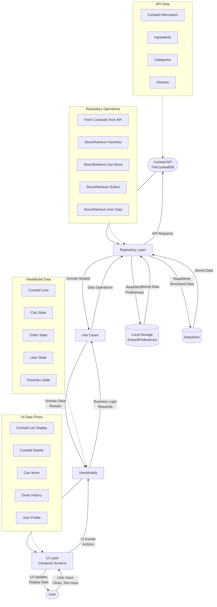

# Data Flow Diagram

This data flow diagram shows how data moves through the CocktailCraft application, from user input through the various layers to external systems and back to the user interface.