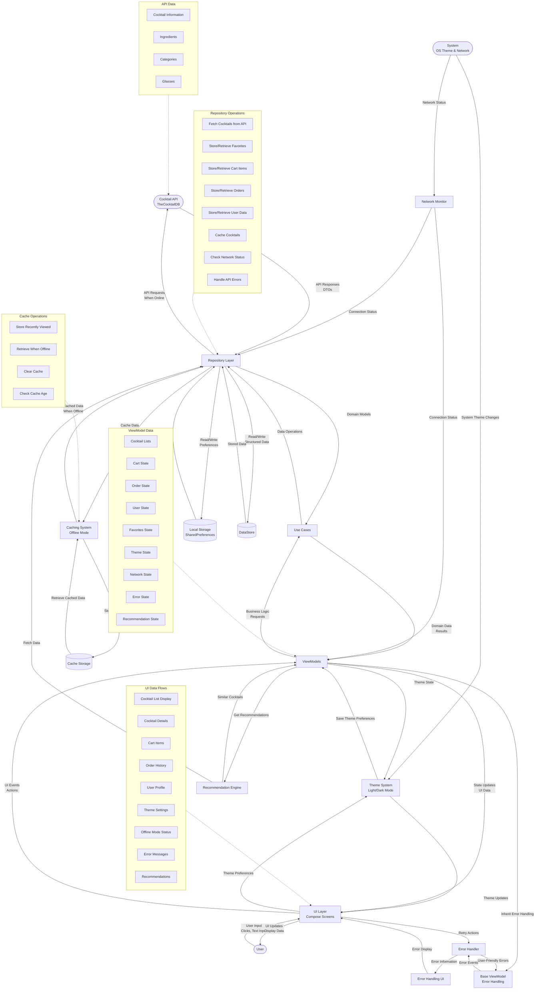

# Data Flow Diagram

This data flow diagram shows how data moves through the CocktailCraft application, including:

1. **User Interface Layer**: Shows how user input flows through the UI components, including theme settings and error handling UI
2. **ViewModel Layer**: Illustrates how ViewModels manage state and handle errors through the BaseViewModel
3. **Domain Layer**: Shows how Use Cases and the Recommendation Engine interact with repositories
4. **Data Layer**: Depicts how repositories interact with the API, caching system, and local storage
5. **External Systems**: Includes the Cocktail API, system theme changes, and network status

The diagram highlights the new features:
- **Dark Mode**: Theme system with user preferences and system theme integration
- **Offline Mode**: Caching system and network monitoring for offline functionality
- **Error Handling**: Comprehensive error handling flow from API to user interface
- **Recommendation System**: Flow of data for cocktail recommendations