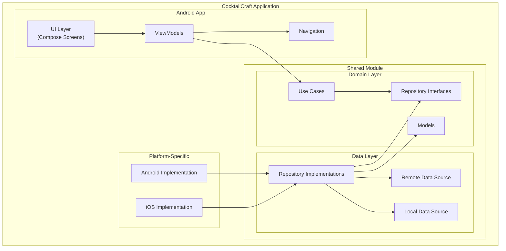

# High-Level Architecture Diagram

This diagram shows the high-level architecture of the CocktailCraft application, including the Android App (UI Layer, ViewModels, Navigation) and the Shared Module (Domain Layer, Data Layer, Platform-Specific implementations).