# High-Level Architecture Diagram

```mermaid
graph TD
    subgraph "CocktailCraft Application"
        subgraph "Android App"
            UI["UI Layer<br>(Compose Screens)"]
            Theme["Theme System<br>(Light/Dark Mode)"]
            VM["ViewModels"]
            Nav["Navigation"]
            ErrorUI["Error Handling UI"]
        end

        subgraph "Shared Module"
            subgraph "Domain Layer"
                Models["Models"]
                RepoInt["Repository Interfaces"]
                UC["Use Cases"]
                RecEngine["Recommendation Engine"]
            end

            subgraph "Data Layer"
                RepoImpl["Repository Implementations"]
                Remote["Remote Data Source"]
                Local["Local Data Source"]
                Cache["Caching System"]
                Network["Network Monitor"]
                ErrorHandler["Error Handler"]
            end

            subgraph "Cross-Cutting Concerns"
                DI["Dependency Injection<br>(Koin)"]
                Config["App Configuration"]
            end
        end

        subgraph "Platform-Specific"
            AndroidImpl["Android Implementation"]
            iOSImpl["iOS Implementation"]
        end
    end

    %% Relationships
    UI --> VM
    UI --> Theme
    UI --> ErrorUI
    VM --> UC
    VM --> RecEngine
    VM --> Nav
    VM --> ErrorHandler
    UC --> RepoInt
    RecEngine --> RepoInt
    RepoImpl --> RepoInt
    RepoImpl --> Remote
    RepoImpl --> Local
    RepoImpl --> Cache
    RepoImpl --> Network
    RepoImpl --> Models
    RepoImpl --> ErrorHandler
    AndroidImpl --> RepoImpl
    iOSImpl --> RepoImpl
    DI --> RepoImpl
    DI --> UC
    DI --> RecEngine
    DI --> VM
    DI --> Network
    Config --> RepoImpl
```

This diagram shows the high-level architecture of the CocktailCraft application, including:

1. **Android App Layer**: UI components, ViewModels, Navigation, Theme System for Dark Mode support, and Error Handling UI
2. **Shared Module**:
   - **Domain Layer**: Models, Repository Interfaces, Use Cases, and Recommendation Engine
   - **Data Layer**: Repository Implementations, Remote/Local Data Sources, Caching System for Offline Mode, Network Monitor, and Error Handler
   - **Cross-Cutting Concerns**: Dependency Injection with Koin and App Configuration
3. **Platform-Specific Implementations**: Android and iOS implementations