# Package Diagram

```mermaid
graph TD
    %% Main package
    CocktailCraft[com.cocktailcraft]

    %% Android App
    AndroidApp[androidApp]
    JavaCocktailCraft[java.com.cocktailcraft.android]

    %% Screens
    Screens[screens]
    HomeScreen[HomeScreen]
    CartScreen[CartScreen]
    FavoritesScreen[FavoritesScreen]
    ProfileScreen[ProfileScreen]
    OrderListScreen[OrderListScreen]
    CocktailDetailScreen[CocktailDetailScreen]
    OfflineModeScreen[OfflineModeScreen]

    %% UI
    UI[ui]
    Components[components]
    Main[main]
    MainScreen[MainScreen]
    Theme[theme]

    %% Navigation
    Navigation[navigation]
    NavigationManager[NavigationManager]

    %% Android platform integrations
    AndroidUtil[util]
    Widget[widget]
    Work[work]
    Sync[sync]
    AndroidAppDI[di]

    %% Entry points
    MainActivity[MainActivity]
    CocktailCraftApplication[CocktailCraftApplication]

    %% Shared Module
    Shared[shared]
    CommonMain[commonMain.kotlin.com.cocktailcraft]

    %% Domain
    Domain[domain]
    DomainModel[model]
    Cocktail[Cocktail]
    CocktailCartItem[CocktailCartItem]
    Order[Order]
    Review[Review]
    User[User]

    DomainRepository[repository]
    CocktailSearchRepository[CocktailSearchRepository]
    CocktailDetailRepository[CocktailDetailRepository]
    CocktailCatalogRepository[CocktailCatalogRepository]
    CocktailFavoritesRepository[CocktailFavoritesRepository]
    CocktailOfflineRepository[CocktailOfflineRepository]
    CartRepository[CartRepository]
    AuthRepository[AuthRepository]
    OrderRepository[OrderRepository]
    ReviewRepository[ReviewRepository]

    UseCase[usecase]
    SearchCocktailsUseCase[SearchCocktailsUseCase]
    GetCocktailDetailUseCase[GetCocktailDetailUseCase]
    ManageFavoritesUseCase[ManageFavoritesUseCase]
    ManageCartUseCase[ManageCartUseCase]
    PlaceOrderUseCase[PlaceOrderUseCase]
    OtherUseCases[...7 more use cases]

    DomainService[service]
    BackgroundSyncService[BackgroundSyncService]

    Config[config]
    AppConfig[AppConfig]

    DomainUtil[util]
    Result[Result]

    %% Shared ViewModels
    SharedVM[viewmodel]
    SharedViewModelBase[SharedViewModel]
    SharedHomeViewModel[SharedHomeViewModel]
    SharedCartViewModel[SharedCartViewModel]
    SharedDetailViewModel[SharedCocktailDetailViewModel]
    OtherSharedVMs[...6 more Shared*ViewModels]
    VMState[state - UiState classes]

    %% Data
    Data[data]
    DataRepository[repository]
    CocktailSearchRepositoryImpl[CocktailSearchRepositoryImpl]
    CocktailDetailRepositoryImpl[CocktailDetailRepositoryImpl]
    CocktailCatalogRepositoryImpl[CocktailCatalogRepositoryImpl]
    CocktailFavoritesRepositoryImpl[CocktailFavoritesRepositoryImpl]
    CocktailOfflineRepositoryImpl[CocktailOfflineRepositoryImpl]
    CartRepositoryImpl[CartRepositoryImpl]
    AuthRepositoryImpl[AuthRepositoryImpl]
    OrderRepositoryImpl[OrderRepositoryImpl]
    ReviewRepositoryImpl[ReviewRepositoryImpl]
    CocktailCategoryFetcher[CocktailCategoryFetcher]

    Cache[cache]
    CocktailCache[CocktailCache]
    CocktailCacheManager[CocktailCacheManager]
    OfflineModePolicy[OfflineModePolicy]

    Remote[remote]
    CocktailApi[CocktailApi]
    CocktailApiImpl[CocktailApiImpl]
    CocktailRemoteDataSource[CocktailRemoteDataSource]

    DataConfig[config]
    AppConfigImpl[AppConfigImpl]

    DataSecurity[security]

    %% Shared util
    SharedUtil[util]
    ErrorHandler[ErrorHandler]
    NetworkMonitor[NetworkMonitor]

    %% DI
    DI[di]
    AppModule[AppModule]
    DataModule[DataModule]
    DomainModule[DomainModule]
    NetworkModule[NetworkModule]
    PlatformModule[PlatformModule]
    SettingsQualifiers[SettingsQualifiers]

    %% Platform-specific
    AndroidMain[androidMain.kotlin.com.cocktailcraft]
    AndroidDI[di.PlatformModule]
    AndroidNetworkMonitor[util.AndroidNetworkMonitor]

    IOSMain[iosMain.kotlin.com.cocktailcraft]
    IOSDI[di.PlatformModule]
    IOSNetworkMonitor[util.IOSNetworkMonitor]

    %% Package Hierarchy
    CocktailCraft --> AndroidApp
    CocktailCraft --> Shared

    AndroidApp --> JavaCocktailCraft

    JavaCocktailCraft --> Screens
    JavaCocktailCraft --> UI
    JavaCocktailCraft --> Navigation
    JavaCocktailCraft --> AndroidUtil
    JavaCocktailCraft --> Widget
    JavaCocktailCraft --> Work
    JavaCocktailCraft --> Sync
    JavaCocktailCraft --> AndroidAppDI
    JavaCocktailCraft --> MainActivity
    JavaCocktailCraft --> CocktailCraftApplication

    Screens --> HomeScreen
    Screens --> CartScreen
    Screens --> FavoritesScreen
    Screens --> ProfileScreen
    Screens --> OrderListScreen
    Screens --> CocktailDetailScreen
    Screens --> OfflineModeScreen

    UI --> Components
    UI --> Main
    UI --> Theme
    Main --> MainScreen

    Navigation --> NavigationManager

    Shared --> CommonMain
    Shared --> AndroidMain
    Shared --> IOSMain

    CommonMain --> Domain
    CommonMain --> Data
    CommonMain --> SharedVM
    CommonMain --> SharedUtil
    CommonMain --> DI

    Domain --> DomainModel
    Domain --> DomainRepository
    Domain --> UseCase
    Domain --> DomainService
    Domain --> Config
    Domain --> DomainUtil

    DomainModel --> Cocktail
    DomainModel --> CocktailCartItem
    DomainModel --> Order
    DomainModel --> Review
    DomainModel --> User

    DomainRepository --> CocktailSearchRepository
    DomainRepository --> CocktailDetailRepository
    DomainRepository --> CocktailCatalogRepository
    DomainRepository --> CocktailFavoritesRepository
    DomainRepository --> CocktailOfflineRepository
    DomainRepository --> CartRepository
    DomainRepository --> AuthRepository
    DomainRepository --> OrderRepository
    DomainRepository --> ReviewRepository

    UseCase --> SearchCocktailsUseCase
    UseCase --> GetCocktailDetailUseCase
    UseCase --> ManageFavoritesUseCase
    UseCase --> ManageCartUseCase
    UseCase --> PlaceOrderUseCase
    UseCase --> OtherUseCases

    DomainService --> BackgroundSyncService
    Config --> AppConfig
    DomainUtil --> Result

    SharedVM --> SharedViewModelBase
    SharedVM --> SharedHomeViewModel
    SharedVM --> SharedCartViewModel
    SharedVM --> SharedDetailViewModel
    SharedVM --> OtherSharedVMs
    SharedVM --> VMState

    Data --> DataRepository
    Data --> Remote
    Data --> Cache
    Data --> DataConfig
    Data --> DataSecurity

    DataRepository --> CocktailSearchRepositoryImpl
    DataRepository --> CocktailDetailRepositoryImpl
    DataRepository --> CocktailCatalogRepositoryImpl
    DataRepository --> CocktailFavoritesRepositoryImpl
    DataRepository --> CocktailOfflineRepositoryImpl
    DataRepository --> CartRepositoryImpl
    DataRepository --> AuthRepositoryImpl
    DataRepository --> OrderRepositoryImpl
    DataRepository --> ReviewRepositoryImpl
    DataRepository --> CocktailCategoryFetcher

    Cache --> CocktailCache
    Cache --> CocktailCacheManager
    Cache --> OfflineModePolicy

    Remote --> CocktailApi
    Remote --> CocktailApiImpl
    Remote --> CocktailRemoteDataSource

    DataConfig --> AppConfigImpl

    SharedUtil --> ErrorHandler
    SharedUtil --> NetworkMonitor

    DI --> AppModule
    DI --> DataModule
    DI --> DomainModule
    DI --> NetworkModule
    DI --> PlatformModule
    DI --> SettingsQualifiers

    AndroidMain --> AndroidDI
    AndroidMain --> AndroidNetworkMonitor

    IOSMain --> IOSDI
    IOSMain --> IOSNetworkMonitor

    %% Dependencies between packages
    Screens --> SharedVM
    Screens --> Navigation
    Screens --> UI
    Main --> Screens
    Main --> Navigation

    Widget --> DomainRepository
    Work --> DomainService
    Sync --> DomainService

    SharedVM --> UseCase
    SharedVM --> DomainModel
    SharedVM --> NetworkMonitor
    SharedVM --> ErrorHandler

    UseCase --> DomainRepository
    UseCase --> DomainModel

    DataRepository --> DomainRepository
    DataRepository --> DomainModel
    DataRepository --> Remote
    DataRepository --> Cache

    CocktailCache --> Cocktail
    DataConfig --> Config

    AppModule --> DataModule
    AppModule --> DomainModule
    AppModule --> NetworkModule

    DataModule --> DataRepository
    DataModule --> Cache
    DataModule --> Remote

    DomainModule --> UseCase
    DomainModule --> SharedVM
    DomainModule --> Config
    DomainModule --> DomainService

    NetworkModule --> Remote

    CocktailCraftApplication --> DI
```

This package diagram shows the organization of the CocktailCraft codebase, including:

1. **Android App**: Compose screens, UI components, navigation, widget/work/sync platform integrations — the ViewModels live in the shared module, not here
2. **Shared Module**:
   - Domain Layer: Models, the nine focused Repository Interfaces (the former monolithic `CocktailRepository` was split into Search/Detail/Catalog/Favorites/Offline plus Cart/Auth/Order/Review), Use Cases, and `BackgroundSyncService`
   - Data Layer: one implementation per repository interface (plus the `CocktailCategoryFetcher` helper), the remote data source, and the caching/offline stack (`CocktailCache`, `CocktailCacheManager`, `OfflineModePolicy`)
   - ViewModels: `SharedViewModel` base class plus nine `Shared*ViewModel`s consumed by both platforms
   - Cross-Cutting Concerns: modular Koin setup (`AppModule` = network + data + domain, plus the per-platform `platformModule()`)
3. **Platform-Specific**: Android and iOS `platformModule()` actuals (Settings stores incl. the secure one, NetworkMonitor implementations)

The diagram shows the relationships and dependencies between these packages, highlighting the modular architecture of the application.
