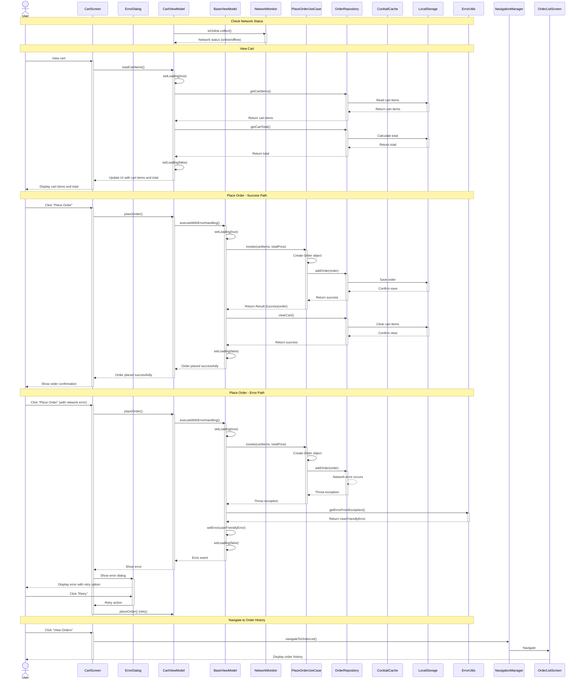

# Sequence Diagram - Place Order

This sequence diagram illustrates the flow of interactions when a user places an order in the CocktailCraft application, including:

1. **Network Status Check**: Monitoring network connectivity before operations
2. **View Cart**: Loading and displaying cart items with loading state management
3. **Place Order - Success Path**: The happy path when placing an order succeeds
   - Using BaseViewModel's error handling wrapper
   - Managing loading state
   - Clearing cart after successful order
4. **Place Order - Error Path**: The error handling path when network issues occur
   - Error conversion to user-friendly format
   - Displaying error dialog with retry option
   - Retry flow
5. **Navigation**: Moving to order history after placing an order

The diagram shows how the application handles both successful operations and error scenarios with proper error handling and user feedback.