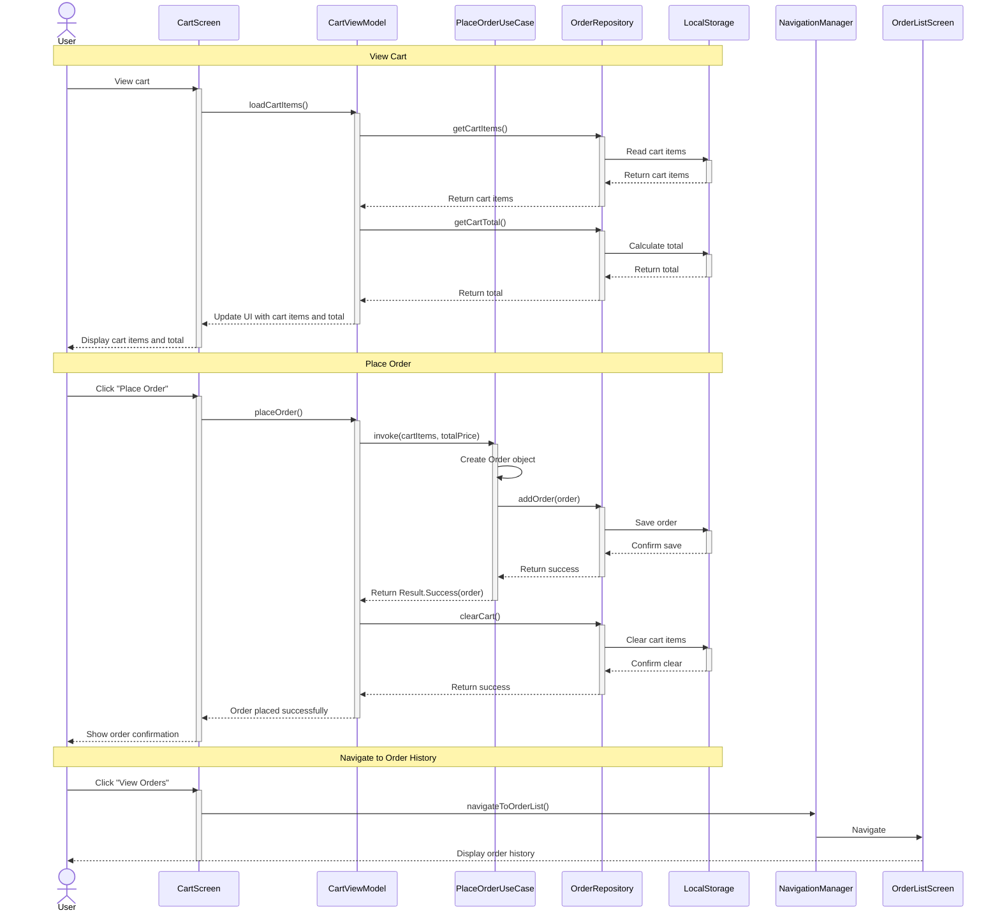

# Sequence Diagram - Place Order

This sequence diagram illustrates the flow of interactions when a user places an order in the CocktailCraft application, including viewing the cart, placing the order, and navigating to the order history.