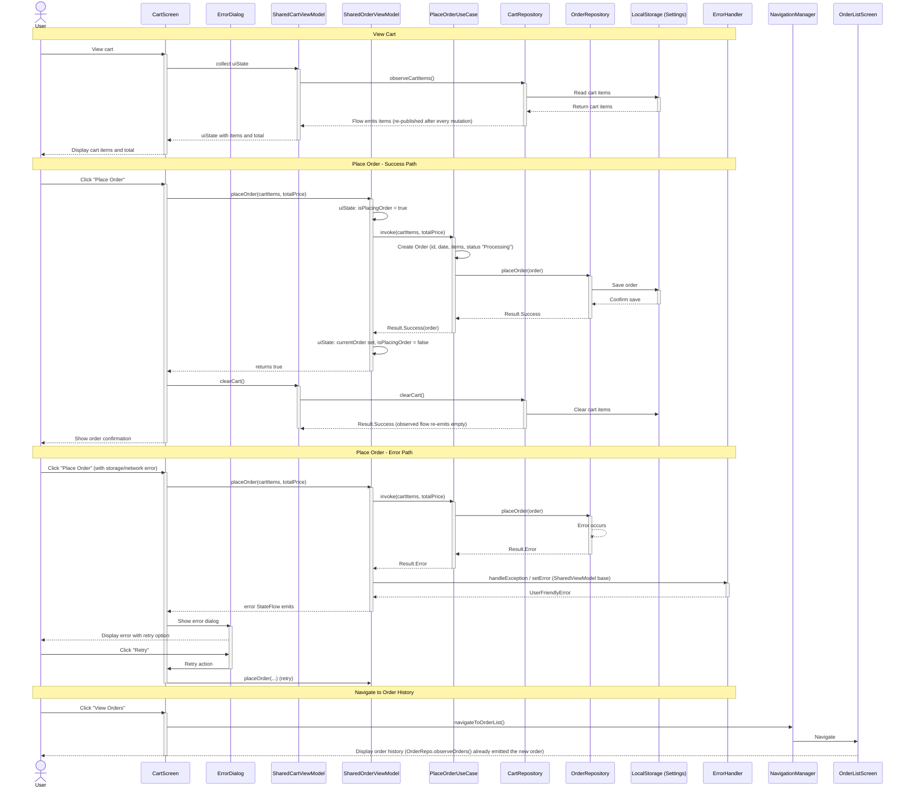

# Sequence Diagram - Place Order

```mermaid
sequenceDiagram
    actor User
    participant UI as CartScreen
    participant ErrorUI as ErrorDialog
    participant CartVM as SharedCartViewModel
    participant OrderVM as SharedOrderViewModel
    participant UC as PlaceOrderUseCase
    participant CartRepo as CartRepository
    participant OrderRepo as OrderRepository
    participant Storage as LocalStorage (Settings)
    participant ErrorHandler as ErrorHandler

    %% View Cart
    Note over User, ErrorHandler: View Cart
    User->>UI: View cart
    activate UI
    UI->>CartVM: collect uiState
    activate CartVM
    CartVM->>CartRepo: observeCartItems()
    activate CartRepo
    CartRepo->>Storage: Read cart items
    activate Storage
    Storage-->>CartRepo: Return cart items
    deactivate Storage
    CartRepo-->>CartVM: Flow emits items (re-published after every mutation)
    deactivate CartRepo
    CartVM-->>UI: uiState with items and total
    deactivate CartVM
    UI-->>User: Display cart items and total
    deactivate UI

    %% Place Order - Success Path
    Note over User, ErrorHandler: Place Order - Success Path
    User->>UI: Click "Place Order"
    activate UI
    UI->>OrderVM: placeOrder(cartItems, totalPrice)
    activate OrderVM
    OrderVM->>OrderVM: uiState: isPlacingOrder = true
    OrderVM->>UC: invoke(cartItems, totalPrice)
    activate UC
    UC->>UC: Create Order (id, date, items, status "Processing")
    UC->>OrderRepo: placeOrder(order)
    activate OrderRepo
    OrderRepo->>Storage: Save order
    activate Storage
    Storage-->>OrderRepo: Confirm save
    deactivate Storage
    OrderRepo-->>UC: Result.Success
    deactivate OrderRepo
    UC-->>OrderVM: Result.Success(order)
    deactivate UC
    OrderVM->>OrderVM: uiState: currentOrder set, isPlacingOrder = false
    OrderVM-->>UI: returns true
    deactivate OrderVM
    UI->>CartVM: clearCart()
    activate CartVM
    CartVM->>CartRepo: clearCart()
    activate CartRepo
    CartRepo->>Storage: Clear cart items
    CartRepo-->>CartVM: Result.Success (observed flow re-emits empty)
    deactivate CartRepo
    deactivate CartVM
    UI-->>User: Show order confirmation
    deactivate UI

    %% Place Order - Error Path
    Note over User, ErrorHandler: Place Order - Error Path
    User->>UI: Click "Place Order" (with storage/network error)
    activate UI
    UI->>OrderVM: placeOrder(cartItems, totalPrice)
    activate OrderVM
    OrderVM->>UC: invoke(cartItems, totalPrice)
    activate UC
    UC->>OrderRepo: placeOrder(order)
    activate OrderRepo
    OrderRepo--xOrderRepo: Error occurs
    OrderRepo-->>UC: Result.Error
    deactivate OrderRepo
    UC-->>OrderVM: Result.Error
    deactivate UC
    OrderVM->>ErrorHandler: handleException / setError (SharedViewModel base)
    activate ErrorHandler
    ErrorHandler-->>OrderVM: UserFriendlyError
    deactivate ErrorHandler
    OrderVM-->>UI: error StateFlow emits
    deactivate OrderVM
    UI->>ErrorUI: Show error dialog
    activate ErrorUI
    ErrorUI-->>User: Display error with retry option
    User->>ErrorUI: Click "Retry"
    ErrorUI->>UI: Retry action
    deactivate ErrorUI
    UI->>OrderVM: placeOrder(...) (retry)
    deactivate UI

    %% Navigate to Order History
    Note over User, ErrorHandler: Navigate to Order History
    User->>UI: Click "View Orders"
    activate UI
    UI->>NavigationManager: navigateToOrderList()
    NavigationManager->>OrderListScreen: Navigate
    OrderListScreen-->>User: Display order history (OrderRepo.observeOrders() already emitted the new order)
    deactivate UI
```

This sequence diagram illustrates the flow of interactions when a user places an order in the CocktailCraft application, including:

1. **View Cart**: The cart UI collects `SharedCartViewModel.uiState`, fed by `CartRepository.observeCartItems()` — a hot flow re-published after every mutation
2. **Place Order - Success Path**: `SharedOrderViewModel.placeOrder(cartItems, totalPrice)` invokes `PlaceOrderUseCase`, which builds the `Order` and persists it via `OrderRepository.placeOrder(order)` (suspend, returns `Result`); the screen then clears the cart through `SharedCartViewModel`
3. **Place Order - Error Path**: Errors are classified by `ErrorHandler` through the `SharedViewModel` base class and surface on the shared `error` StateFlow, displayed with a retry option
4. **Navigation**: Order history reflects the new order automatically via `OrderRepository.observeOrders()`

The diagram shows how the application handles both successful operations and error scenarios with proper error handling and user feedback.
