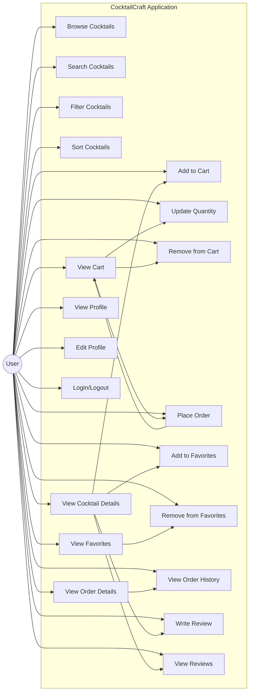

# Use Case Diagram

This diagram illustrates the main user interactions with the CocktailCraft system, including browsing cocktails, searching, filtering, viewing details, managing cart, placing orders, managing favorites, and writing reviews.