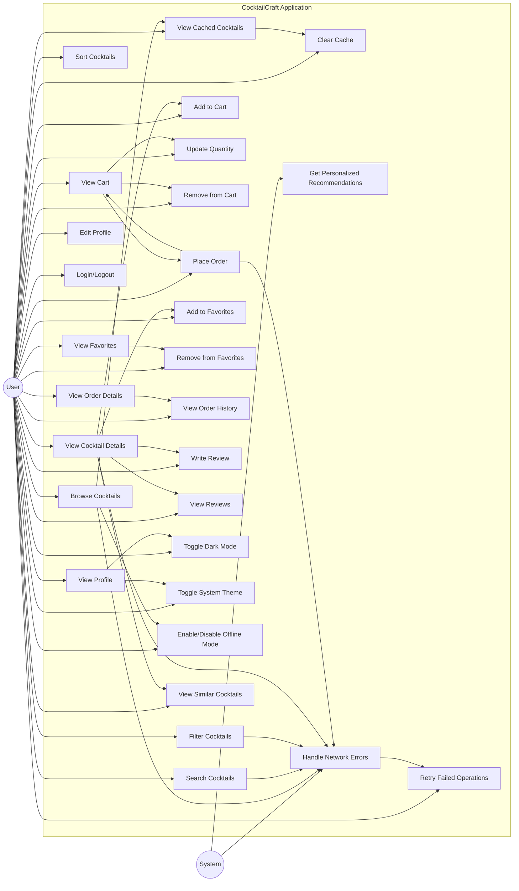

# Use Case Diagram

This diagram illustrates the main user interactions with the CocktailCraft system, including:

1. **Core Functionality**: Browsing cocktails, searching, filtering, viewing details, managing cart, placing orders, managing favorites, and writing reviews
2. **Theme Management**: Toggling dark mode and system theme integration
3. **Offline Mode**: Enabling/disabling offline mode, viewing cached cocktails, and clearing cache
4. **Recommendations**: Viewing similar cocktails and getting personalized recommendations
5. **Error Handling**: Handling network errors and retrying failed operations

The diagram shows both user-initiated use cases and system-initiated use cases, as well as the relationships between them.